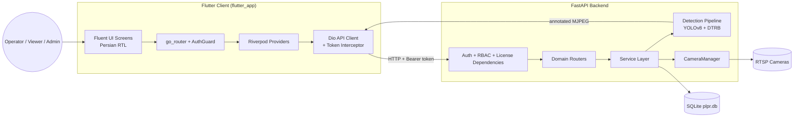
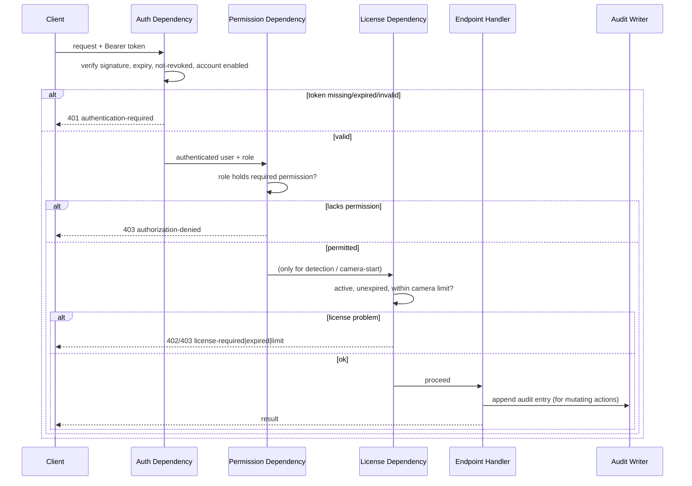
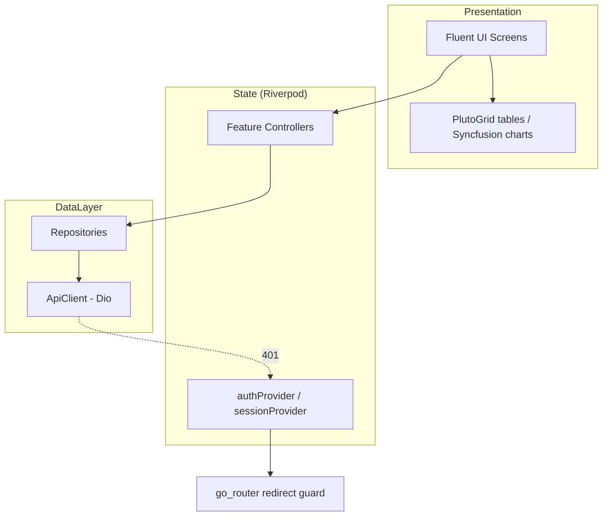

# Design Document

## Overview

This design describes the complete redesign of a Persian Automatic Number Plate Recognition
(ANPR) system across two layers: a Flutter client (`flutter_app/`) and a FastAPI backend (the
Python modules at the repository root). The redesign preserves the proven detection pipeline
(YOLOv8 detector + DTRB recognizer), camera management, and reporting capabilities that already
exist, while adding three capability areas the current system lacks — **authentication**,
**role-based authorization (RBAC)**, and **software license management** — plus supporting
features observed in commercial ANPR products: **watchlist/hotlist matching with alerts**,
**audit logging**, **configurable data retention**, and **searchable, exportable detection
records**.

### Goals

- Add a security perimeter (login, session tokens, RBAC) in front of every protected endpoint
  without disturbing the existing detection/camera/reporting logic.
- Gate detection and camera-start operations behind a valid software license.
- Add watchlist matching that raises alerts in real time as detections occur.
- Make every security-relevant action auditable and every detection searchable and exportable.
- Rebuild the Flutter client with a professional security-monitoring look using Fluent UI,
  PlutoGrid data grids, Syncfusion charts/gauges, Riverpod state management, and go_router
  navigation — fully in Persian with right-to-left (RTL) layout.

### Design Principles

1. **Preserve the working core.** The detection pipeline (`video_processor.py`), the
   `CameraManager`, the plate parsing/classification modules (`plate_metadata.py`,
   `plate_reference.py`, `plate_validator.py`), and the reporting queries in `db.py` are kept.
   New concerns are layered around them rather than rewritten.
2. **Security as middleware.** Authentication and authorization are enforced through FastAPI
   dependencies so that protecting an endpoint is declarative and consistent.
3. **Pure logic is isolated and testable.** Token signing/verification, password hashing, RBAC
   permission resolution, license validity, digit normalization, plate round-tripping, watchlist
   matching, retention cutoff, and export row building are pure functions with deterministic
   input/output, which makes them well suited to property-based testing.
4. **Append-only audit.** Audit log writes happen at the same call sites as the actions they
   record, and the storage layer offers no update/delete path for audit rows.

### Existing vs. New Components

| Area | Current state | Redesign action |
|------|---------------|-----------------|
| Detection (image/video/RTSP) | Implemented in `api.py` + `video_processor.py` | Preserve; wrap with auth + license + watchlist hooks |
| Camera management | `CameraManager` + `db.py` camera CRUD | Preserve; add license camera-limit enforcement |
| Concurrent streaming | `CameraManager` FIFO queue | Preserve as-is |
| Network scanner | In `api.py` | Preserve; protect with auth |
| Reporting/analytics | `db.py` query functions | Preserve; add export + retention |
| Plate formatting/classification | `plate_metadata.py`, `plate_reference.py` | Preserve |
| Authentication | **None** | New: users, password hashing, session tokens |
| Authorization (RBAC) | **None** | New: roles, permissions, dependency guard |
| License management | **None** | New: license key validation, status, limits |
| Watchlists / alerts | **None** | New: watchlist CRUD + match-on-detection |
| Audit logging | **None** | New: append-only audit table + writer |
| Data retention | **None** | New: retention policy + pruning task |
| Detection export | **None** | New: CSV export endpoint |
| Frontend stack | Material + fl_chart | New: Fluent UI + PlutoGrid + Syncfusion |

## Architecture

### System Context



### Backend Request Pipeline

Every protected request passes through an ordered chain of FastAPI dependencies before reaching
the endpoint handler:



The ordering is deliberate: **authentication precedes authorization precedes licensing**. A
request with no token is rejected as unauthenticated before any permission or license check runs.
License checks apply only to detection and camera-start operations (Requirement 3); login,
license activation, and license status remain reachable while no license exists.

### Backend Module Layout

The backend is reorganized into a package while keeping the existing root modules importable. New
concerns live in dedicated modules so the existing files change minimally.

```
api.py                 # FastAPI app assembly + lifespan; includes routers
auth/
  security.py          # password hashing, token signing/verification (pure)
  dependencies.py      # FastAPI deps: current_user, require_permission, require_license
  rbac.py              # role → permission mapping + permission resolution (pure)
licensing/
  license_key.py       # license key decode + validation (pure)
  service.py           # activate, status, enforcement against DB
watchlist/
  matching.py          # normalization + match logic (pure)
  service.py           # CRUD + alert creation
retention/
  policy.py            # cutoff computation (pure)
  service.py           # prune task
export/
  csv_export.py        # detection row → CSV (pure row building)
audit/
  service.py           # append-only audit writer + reader
routers/
  auth.py users.py licenses.py cameras.py detection.py
  scanner.py watchlists.py alerts.py reports.py export.py audit.py retention.py
db.py                  # extended schema + query functions (existing + new tables)
schemas.py             # extended Pydantic models
# preserved as-is: camera_manager.py, video_processor.py,
#                  plate_metadata.py, plate_reference.py, plate_validator.py
```

### Frontend Architecture

The Flutter client follows a feature-first layout (already present under `lib/features/`) and
layers Riverpod state on top of repositories that wrap the Dio API client.



Key cross-cutting frontend mechanisms:

- **Token interceptor**: a Dio interceptor attaches the stored `Session_Token` as a Bearer header
  and, on a `401` response, clears the token and triggers a redirect to login (Requirement 18.3).
- **Router redirect guard**: `go_router`'s `redirect` consults `authProvider`; unauthenticated
  users are forced to `/login` and away from protected routes (Requirement 18.1).
- **Permission-aware widgets**: controls whose action the current role lacks are hidden or
  disabled based on the role/permission set returned at login (Requirement 18.4, 2.x).
- **RTL + Persian locale**: the app sets `Directionality.rtl`, a Persian locale, and the Vazirmatn
  font globally; numbers/dates/times are formatted with a Persian formatter (Requirement 17).

### Technology Decisions

- **Session tokens**: signed, stateless **JWT-style** tokens carrying `sub` (user id), `role`,
  `iat`, and `exp`, signed with an HMAC server secret. Statelessness keeps verification a pure
  function. Logout (Requirement 1.7) requires invalidation, so a small server-side **revocation
  set** (token id `jti` stored until expiry) is consulted during verification. This hybrid keeps
  the common path pure while supporting explicit logout.
- **Password hashing**: a salted one-way hash via `passlib`/`bcrypt` (Requirement 1.3). Never
  implement hashing by hand.
- **License key**: a signed, encoded payload (base64url of a JSON claim set + HMAC signature)
  carrying `expiry` and `camera_limit`. Validation is a pure decode-and-verify step
  (Requirement 3.1, 3.2). The server secret prevents forgery.
- **Persistence**: continue with **SQLite** (`database/plpr.db`) via the existing `db.py`
  connection helpers; add new tables through the same idempotent `init_db()` / `_ensure_column`
  migration pattern already in use.
- **Frontend grid/charts**: **PlutoGrid** for tabular data (sorting, column controls — Requirement
  17.5) and **Syncfusion Flutter Charts/Gauges** for analytics (Requirement 17.6); **Fluent UI for
  Flutter** for the overall design language (Requirement 17.3). These are additive `pubspec.yaml`
  dependencies alongside the existing Riverpod/go_router/dio stack.

## Components and Interfaces

### Authentication Component

**Responsibility:** prove and carry user identity.

- `hash_password(plain) -> str` / `verify_password(plain, hashed) -> bool` — salted one-way hash.
- `create_session_token(user_id, role, ttl) -> str` — signs a token with `exp` and a unique `jti`.
- `verify_session_token(token) -> TokenClaims | AuthError` — checks signature, expiry, revocation,
  and (via lookup) that the account is enabled. Pure except for the revocation-set lookup.
- `revoke_token(jti, exp)` — adds a token id to the revocation set on logout.
- FastAPI dependency `current_user()` — extracts the Bearer token, verifies it, loads the user,
  and yields the authenticated `User`; raises `401` for missing/expired/invalid/revoked tokens or
  disabled accounts (Requirements 1.4–1.8).
- **Bootstrap**: on `init_db()`, if no users exist, create one default Admin account
  (Requirement 1.9).

Endpoints: `POST /api/auth/login`, `POST /api/auth/logout`, `GET /api/auth/me`.

### Authorization (RBAC) Component

**Responsibility:** decide whether a role may perform an action.

- A static mapping `ROLE_PERMISSIONS: dict[Role, set[Permission]]` encodes the matrix below.
- `role_has_permission(role, permission) -> bool` — pure resolution, with Admin implicitly
  holding all permissions (Requirement 2.5).
- FastAPI dependency factory `require_permission(permission)` — returns a dependency that loads the
  current user and permits the request only if the role holds the permission, else `403`
  (Requirements 2.2–2.4). Protected endpoints that define no specific permission still depend on
  `current_user()`, so they are always authorization-checked (Requirement 2.4).

**Permission matrix (Requirements 2.5–2.7):**

| Permission | Viewer | Operator | Admin |
|------------|:------:|:--------:|:-----:|
| view detections/sessions/reports/streams | ✓ | ✓ | ✓ |
| manage cameras | | ✓ | ✓ |
| run detections | | ✓ | ✓ |
| manage watchlists | | ✓ | ✓ |
| manage users | | | ✓ |
| manage roles | | | ✓ |
| manage licenses | | | ✓ |
| manage system config (concurrency, retention) | | | ✓ |
| view audit log | | | ✓ |

Operator inherits all Viewer permissions; Admin inherits all Operator and Viewer permissions.

User management endpoints: `POST /api/users`, `GET /api/users`, `PATCH /api/users/{id}` (role,
enable/disable, password), `DELETE /api/users/{id}`. The service rejects deleting or disabling the
last remaining Admin (Requirement 2.10).

### License Management Component

**Responsibility:** authorize system use within limits and an expiry.

- `decode_license_key(key) -> LicenseClaims | None` — pure decode + signature verification
  (Requirement 3.1, 3.2).
- `activate_license(key) -> License` — validates and stores the active license with expiry and
  camera limit; rejects invalid keys (Requirements 3.1, 3.2).
- `get_license_status() -> LicenseStatus` — returns activation state, expiry, camera limit, and
  configured-camera count (Requirement 3.5).
- `is_license_valid(now) -> bool` — true only if an active license exists and is unexpired.
- FastAPI dependency `require_license()` — guards detection and camera-start endpoints; returns
  `license-required` when none active (Requirement 3.3), `license-expired` when past expiry
  (Requirement 3.4), and `license-limit` when starting a camera would exceed the camera limit
  (Requirement 3.6). Auth, activation, and status endpoints are never license-gated
  (Requirement 3.7).

Endpoints: `POST /api/licenses/activate`, `GET /api/licenses/status`.

### Camera Management & Streaming Component (preserved)

The existing `CameraManager` and camera CRUD in `db.py` are retained unchanged in behavior
(Requirements 4 and 5). The redesign only:

- Adds `require_permission("manage_cameras")` and, for start operations, `require_license()`.
- Adds a camera-limit check at start time using the active license's `camera_limit`
  (Requirement 3.6) before the manager's concurrency check.

Live stream delivery (Requirement 6) reuses the existing MJPEG and latest-frame endpoints,
now behind `current_user()` with the view-streams permission.

### Detection Component (preserved + hooked)

Image (Req 8), video (Req 9), and RTSP (Req 10) detection keep their current handlers and the
`video_processor.py` pipeline. Two hooks are added at the detection persistence point
(`save_detection`):

1. **Watchlist matching** (Requirement 12.4): after a detection is saved, the watchlist matcher
   compares its normalized plate value against active entries and creates alerts on matches.
2. **Persian formatting** continues via `format_plate_persian` / `Pretty_Printer`
   (Requirements 8.5, 11.1).

### Plate Formatting & Classification Component (preserved)

`plate_metadata.derive_metadata`, `plate_reference`, and `plate_validator` are retained
(Requirement 11). The `Plate_Parser` is the existing `normalize_plate`, and digit normalization is
the existing `_normalise_digits` (Persian/Arabic/Latin → canonical ASCII). The round-trip property
(Requirement 11.7) is validated against these functions plus `format_plate_persian`.

### Watchlist & Alerting Component

**Responsibility:** flag plates of interest and alert on appearance.

- Watchlist CRUD: create watchlist (name, list type), add entry (plate value, optional
  label/reason), remove entry (Requirements 12.1–12.3).
- `normalize_for_match(value) -> str` — pure digit normalization + separator stripping, identical
  canonicalization for both detection plate and entry plate (Requirement 12.7).
- `find_matches(plate_value, active_entries) -> list[Entry]` — pure matcher; only entries that
  still exist (not deleted) are considered active (Requirement 12.5).
- `create_alert(detection, entry)` — persists an alert referencing both (Requirement 12.4).
- Alert list returns most-recent-first (Requirement 12.6).

Endpoints: `POST /api/watchlists`, `GET /api/watchlists`, `POST /api/watchlists/{id}/entries`,
`DELETE /api/watchlists/entries/{entry_id}`, `GET /api/alerts`.

### Reporting & Analytics Component (preserved + extended)

Reuses `db.py` query functions for detections (Req 13.1–13.2), timeline (13.3), stats (13.4),
source distribution (13.5), confidence distribution (13.6), and sessions (13.7). All are read-only
and behind the view permission.

### Export Component

- `build_detection_csv(rows) -> str` — pure function turning detection records into CSV with a
  fixed header (timestamp, source type, DTRB plate text, Persian plate string, confidence) and a
  camera-name column when any row is camera-sourced (Requirements 14.1–14.3). Empty result sets
  produce a header-only file (Requirement 14.4).
- Endpoint: `GET /api/export/detections` returning a downloadable file, accepting the same
  source-type and search filters as the detection list.

### Audit Logging Component

- `write_audit(user, action, resource, outcome)` — appends an entry with username, action,
  resource, outcome, and timestamp. Called at login/logout (Requirement 15.1) and on
  create/update/delete of cameras, users, watchlists, and licenses (Requirement 15.2).
- `list_audit(limit)` — returns entries most-recent-first; `limit > 0` returns that many,
  `limit == 0` returns all (Requirements 15.3, 15.4).
- The storage layer exposes **no** update or delete operation for audit rows; any such request is
  rejected (Requirement 15.5).

### Data Retention Component

- `set_retention_policy(days)` — persists a policy for `days > 0`; rejects `days <= 0`
  (Requirements 16.1, 16.4).
- `retention_cutoff(now, days) -> datetime` — pure cutoff = `now - days`.
- `prune_detections(now)` — while a policy is active, deletes detections older than the cutoff
  (Requirement 16.2); with no policy configured, retains everything (Requirement 16.3). Runs on a
  scheduled background task and on demand.

Endpoints: `GET/PUT /api/config/retention`.

### Frontend Components

| Screen / Component | Purpose | Widgets |
|--------------------|---------|---------|
| Login | Authenticate, store token | Fluent `TextBox`, `Button` |
| Dashboard | KPIs, recent activity | Syncfusion gauges/charts |
| Live Monitoring | MJPEG streams + live detections | Video + Fluent cards |
| Cameras | CRUD + start/stop + scanner | PlutoGrid + Fluent dialogs |
| Detection | Image/video/RTSP runs | Fluent forms + preview |
| Detections/History | Searchable records + export | PlutoGrid + export button |
| Analytics | Timeline, source/confidence dist. | Syncfusion charts |
| Sessions | Session history | PlutoGrid |
| Watchlists & Alerts | Manage lists, view alerts | PlutoGrid + Fluent |
| Users (Admin) | User/role management | PlutoGrid + Fluent |
| License (Admin) | Activate + status | Fluent forms |
| Audit (Admin) | View audit log | PlutoGrid |
| Settings (Admin) | Concurrency + retention | Fluent forms |

All screens use a shared RTL Fluent scaffold with a Persian `NavigationPane`, Persian-locale
number/date formatting, and permission-aware visibility.

## Data Models

### Backend Domain Types

```python
# Roles & permissions
Role = Literal["Admin", "Operator", "Viewer"]
Permission = Literal[
    "view", "manage_cameras", "run_detection", "manage_watchlists",
    "manage_users", "manage_roles", "manage_licenses", "manage_config", "view_audit",
]

@dataclass
class User:
    id: int
    username: str
    password_hash: str
    role: Role
    disabled: bool
    created_at: str

@dataclass
class TokenClaims:
    sub: int          # user id
    role: Role
    jti: str          # token id (for revocation)
    iat: int
    exp: int

@dataclass
class LicenseClaims:
    expiry: str       # ISO date
    camera_limit: int

@dataclass
class License:
    id: int
    key: str
    active: bool
    expiry: str
    camera_limit: int
    activated_at: str

@dataclass
class WatchlistEntry:
    id: int
    watchlist_id: int
    plate_value: str       # normalized canonical form stored alongside raw
    label: str | None
    reason: str | None

@dataclass
class Alert:
    id: int
    detection_id: int
    entry_id: int
    plate_value: str
    created_at: str
```

### New Database Tables

Added via the existing idempotent `init_db()` pattern in `db.py`:

```sql
CREATE TABLE IF NOT EXISTS users (
    id INTEGER PRIMARY KEY AUTOINCREMENT,
    username TEXT NOT NULL UNIQUE,
    password_hash TEXT NOT NULL,
    role TEXT NOT NULL DEFAULT 'Viewer',
    disabled INTEGER NOT NULL DEFAULT 0,
    created_at TEXT NOT NULL
);

CREATE TABLE IF NOT EXISTS revoked_tokens (
    jti TEXT PRIMARY KEY,
    exp INTEGER NOT NULL            -- purged after expiry
);

CREATE TABLE IF NOT EXISTS licenses (
    id INTEGER PRIMARY KEY AUTOINCREMENT,
    key TEXT NOT NULL,
    active INTEGER NOT NULL DEFAULT 0,
    expiry TEXT NOT NULL,
    camera_limit INTEGER NOT NULL,
    activated_at TEXT NOT NULL
);

CREATE TABLE IF NOT EXISTS watchlists (
    id INTEGER PRIMARY KEY AUTOINCREMENT,
    name TEXT NOT NULL,
    list_type TEXT NOT NULL,         -- e.g. blocklist | allowlist
    created_at TEXT NOT NULL
);

CREATE TABLE IF NOT EXISTS watchlist_entries (
    id INTEGER PRIMARY KEY AUTOINCREMENT,
    watchlist_id INTEGER NOT NULL REFERENCES watchlists(id),
    plate_raw TEXT NOT NULL,
    plate_norm TEXT NOT NULL,        -- canonical digit form for matching
    label TEXT,
    reason TEXT,
    created_at TEXT NOT NULL
);

CREATE TABLE IF NOT EXISTS alerts (
    id INTEGER PRIMARY KEY AUTOINCREMENT,
    detection_id INTEGER NOT NULL REFERENCES detections(id),
    entry_id INTEGER NOT NULL REFERENCES watchlist_entries(id),
    plate_value TEXT NOT NULL,
    created_at TEXT NOT NULL
);

CREATE TABLE IF NOT EXISTS audit_log (
    id INTEGER PRIMARY KEY AUTOINCREMENT,
    username TEXT,
    action TEXT NOT NULL,
    resource TEXT,
    outcome TEXT NOT NULL,
    timestamp TEXT NOT NULL
);
-- Retention policy stored in existing app_config table: key='retention_days'.

CREATE INDEX IF NOT EXISTS idx_alerts_created ON alerts(created_at);
CREATE INDEX IF NOT EXISTS idx_audit_ts ON audit_log(timestamp);
CREATE INDEX IF NOT EXISTS idx_wl_entries_norm ON watchlist_entries(plate_norm);
```

The existing `sessions`, `detections`, `cameras`, and `app_config` tables are unchanged;
`detections` already carries `camera_id` / `camera_name` used by the export camera-name column.

### API Response Envelopes (Pydantic, added to `schemas.py`)

- `LoginResponse { token, role, expires_at, permissions: list[str] }`
- `UserView { id, username, role, disabled, created_at }`
- `LicenseStatus { active, expiry, camera_limit, configured_cameras }`
- `WatchlistView`, `WatchlistEntryView`, `AlertView`
- `AuditEntryView`, `RetentionConfig { days }`
- Error envelope `{ error: str, code: str }` with codes such as `auth_required`,
  `auth_failed`, `forbidden`, `license_required`, `license_expired`, `license_limit`,
  `validation_error`, `not_found`, `conflict`.

### Frontend Models (Dart)

Mirror the backend envelopes as immutable Dart classes in `lib/data/models/` (e.g. `Session`,
`UserAuth { token, role, permissions }`, `LicenseStatus`, `Watchlist`, `Alert`, `AuditEntry`),
each with `fromJson`/`toJson`. A `PersianFormat` helper converts numbers/dates/times to
Persian-locale strings for display (Requirement 17.4).

## Correctness Properties

*A property is a characteristic or behavior that should hold true across all valid executions of
a system — essentially, a formal statement about what the system should do. Properties serve as
the bridge between human-readable specifications and machine-verifiable correctness guarantees.*

The properties below are derived from the acceptance-criteria prework. Each is universally
quantified and intended to be implemented as a single property-based test. Side-effect-only,
infrastructure, UI-rendering, and pure-example criteria are covered by unit, integration, and
widget tests in the Testing Strategy rather than by properties.

### Property 1: Password hashing is a one-way, salted round-trip

*For any* password string, `verify_password(password, hash_password(password))` is true, the
produced hash is never equal to the plaintext, and two independent hashes of the same password
differ (distinct salts).

**Validates: Requirements 1.3**

### Property 2: Valid session tokens round-trip to the issuing identity

*For any* user id, role, and positive time-to-live, verifying the token produced by
`create_session_token` recovers the same user id and role and is accepted as authenticated.

**Validates: Requirements 1.1, 1.4**

### Property 3: Invalid session tokens are always rejected

*For any* token that is expired, has a tampered signature/payload, or has been revoked via logout,
and *for any* credentials that do not match a stored account, verification/authentication rejects
the request and issues no session token.

**Validates: Requirements 1.2, 1.5, 1.7**

### Property 4: Disabled accounts cannot authenticate

*For any* account marked disabled, a login attempt with otherwise-correct credentials is rejected
with an authentication-failure and yields no session token.

**Validates: Requirements 1.8**

### Property 5: Authorization permits an action exactly when the role holds the permission

*For any* role drawn from {Admin, Operator, Viewer} and *any* permission, the authorization guard
permits the action if and only if the role holds that permission; Admin holds every permission,
and the Operator permission set is a superset of the Viewer permission set.

**Validates: Requirements 2.2, 2.3, 2.5, 2.6, 2.7**

### Property 6: Role changes take effect on subsequent authorization checks

*For any* user and *any* new role, after the user's role is changed, the user's subsequent
authorization checks are resolved against the new role's permission set.

**Validates: Requirements 2.9**

### Property 7: The last enabled Admin cannot be removed

*For any* set of user accounts, a delete or disable operation that would reduce the number of
enabled Admin accounts to zero is rejected with a validation-error, and the count of enabled
Admins never reaches zero through such operations.

**Validates: Requirements 2.10**

### Property 8: License keys round-trip and validity respects expiry

*For any* license claims (expiry date and camera limit), decoding a correctly signed key recovers
the same expiry and limit and activates an active license; *for any* tampered or forged key
decoding fails and no active license is stored; and *for any* expiry earlier than the current
date the license is treated as invalid.

**Validates: Requirements 3.1, 3.2, 3.4**

### Property 9: Camera starts never exceed the license camera limit

*For any* license camera limit L and *any* running-camera count greater than or equal to L, a
camera-start request is rejected with a license-limit response.

**Validates: Requirements 3.6**

### Property 10: Camera create/update is a persistence round-trip

*For any* valid camera fields (name, URL, skip-frame), creating a camera then reading it back
returns the same field values with an assigned identifier, and updating a camera then reading it
back returns the updated values.

**Validates: Requirements 4.1, 4.3**

### Property 11: Skip-frame values are accepted exactly within 1..1000

*For any* integer, a camera or video skip-frame value is accepted if and only if it lies in the
inclusive range 1 to 1000; out-of-range values are rejected with a validation-error.

**Validates: Requirements 4.7, 9.6**

### Property 12: The camera manager never exceeds its concurrency limit and promotes FIFO

*For any* sequence of start, stop, start-all, and stop-all operations against a concurrency limit,
the number of running cameras never exceeds the limit, cameras started beyond the limit are
queued, freeing a running slot promotes the earliest-queued camera, and stop-all leaves no running
cameras and an empty queue.

**Validates: Requirements 5.1, 5.2, 5.3, 5.4, 5.5, 5.8**

### Property 13: The concurrency limit is accepted exactly within 1..64

*For any* integer, setting the concurrency limit succeeds and persists if and only if the value
lies in the inclusive range 1 to 64; out-of-range values are rejected with a validation-error.

**Validates: Requirements 5.6, 5.7**

### Property 14: Digit normalization is canonical across scripts

*For any* sequence of digits expressed in Persian, Arabic-Indic, or Latin form, normalizing each
representation of the same underlying digits yields one identical canonical string.

**Validates: Requirements 11.2, 12.7**

### Property 15: The pretty-printer always yields a Persian plate string included in responses

*For any* recognized plate text, the Pretty_Printer produces a non-empty Persian-formatted plate
string, and that string is the value returned as the detection's Persian plate field.

**Validates: Requirements 11.1, 8.5**

### Property 16: Plate classification is total and structure-driven

*For any* plate string conforming to the standard Iranian structure (two digits, one letter, three
digits, two-digit region code), the derived metadata is classified with a category, color scheme,
region code, and region name; *for any* non-conforming, empty, or whitespace-only string, the
metadata is unclassified with a reason. The derivation never raises.

**Validates: Requirements 11.3, 11.4, 11.5**

### Property 17: Plate parse/format round-trip preserves components

*For any* valid recognized plate, parsing the plate string, formatting it with the Pretty_Printer,
and parsing the result again yields equivalent plate components.

**Validates: Requirements 11.7**

### Property 18: Free-zone plates carry the free-zone note

*For any* plate classified into a free-zone category, the derived metadata includes the free-zone
special note.

**Validates: Requirements 11.6**

### Property 19: Watchlist entry create/remove is a persistence round-trip

*For any* watchlist (name, list type) and *any* set of entries, creating the watchlist and adding
entries makes them retrievable under that watchlist, and removing an entry makes it no longer
retrievable.

**Validates: Requirements 12.1, 12.2, 12.3**

### Property 20: Detections matching an active watchlist entry raise exactly one referencing alert

*For any* detection plate value and watchlist entry that are equal after canonical normalization
(in any digit script), an alert is created that references both the detection and the entry; *for
any* entry that has been deleted, no alert is created for a matching detection.

**Validates: Requirements 12.4, 12.5, 12.7**

### Property 21: Alerts are returned most-recent-first

*For any* set of alerts, the alert list is returned ordered strictly from most recent to least
recent by creation time.

**Validates: Requirements 12.6**

### Property 22: Detections are persisted under their originating session

*For any* set of detections produced by an image, video, or RTSP run, each detection is stored as
a record under that run's session (and, for live streams, appears in the processor's recent
detection history), with the count of stored detections equal to the number recognized.

**Validates: Requirements 8.3, 10.4, 6.4**

### Property 23: Detection queries return exactly the matching records and total

*For any* set of detection records and *any* combination of limit, offset, source-type filter, and
search term, every returned record matches the filter and search term, no more than `limit`
records are returned, and the reported total equals the count of all matching records.

**Validates: Requirements 13.1**

### Property 24: Reporting range parameters are bounded and complete

*For any* requested detection-list limit, the value is accepted if and only if it lies in 1..1000;
*for any* requested timeline day count in 1..90, the result contains a per-day count bucket for
each day in the requested range.

**Validates: Requirements 13.2, 13.3**

### Property 25: Distribution groupings partition the detection set

*For any* set of detections, the sum of the per-group counts in the source-type distribution
equals the total number of detections, and likewise the sum of the per-bin counts in the
confidence distribution equals the total number of detections.

**Validates: Requirements 13.5, 13.6**

### Property 26: Session history is returned most-recent-first

*For any* set of sessions, the session-history list is returned ordered from most recent to least
recent.

**Validates: Requirements 13.7**

### Property 27: Export reflects matches, required fields, and the camera-name rule

*For any* set of detections and export filters, the produced CSV contains exactly one data row per
matching detection with the timestamp, source type, DTRB plate text, Persian plate string, and
confidence; a camera-name column is present and populated for camera-sourced rows whenever the
result contains at least one camera-sourced detection; and an empty result yields a file
containing only the header row.

**Validates: Requirements 14.1, 14.2, 14.3, 14.4**

### Property 28: Auditable actions always append a complete audit entry

*For any* login attempt (success or failure) and *for any* create/update/delete of a camera, user,
watchlist, or license, exactly one audit entry is appended recording the username/user, the
action, the affected resource (where applicable), the outcome, and a timestamp.

**Validates: Requirements 15.1, 15.2**

### Property 29: Audit retrieval honors limit and most-recent-first ordering

*For any* set of audit entries and *any* limit, requesting the audit log with a limit greater than
zero returns `min(limit, total)` entries and a limit of zero returns all entries, in both cases
ordered from most recent to least recent.

**Validates: Requirements 15.3, 15.4**

### Property 30: Retention pruning removes exactly the records older than the cutoff

*For any* set of detection records and *any* retention policy of days greater than zero, pruning
removes exactly the detections whose timestamp is older than `now - days` and retains all others;
when no policy is configured pruning removes nothing; and any attempt to set a policy of zero or
fewer days is rejected with a validation-error.

**Validates: Requirements 16.1, 16.2, 16.3, 16.4**

### Property 31: Persian-locale formatting round-trips numbers and dates

*For any* number or date/time, the Persian-locale formatter produces output using Persian digits,
and parsing that output recovers the original value.

**Validates: Requirements 17.4**

## Error Handling

The backend uses a consistent error envelope `{ "error": <message>, "code": <code> }` with the
appropriate HTTP status, so the client can branch on a stable `code` rather than parsing messages.

| Condition | Code | HTTP | Source requirement |
|-----------|------|------|--------------------|
| Missing/expired/invalid/revoked token | `auth_required` | 401 | 1.5, 1.6 |
| Wrong credentials / disabled account | `auth_failed` | 401 | 1.2, 1.8 |
| Role lacks permission | `forbidden` | 403 | 2.3 |
| No active license (detection/camera-start) | `license_required` | 402 | 3.3 |
| Active license expired | `license_expired` | 402 | 3.4 |
| Camera-start exceeds camera limit | `license_limit` | 409 | 3.6 |
| Invalid license key | `validation_error` | 422 | 3.2 |
| Out-of-range skip-frame / concurrency / retention / limit | `validation_error` | 422 | 4.7, 5.7, 16.4, 13.2 |
| Last-admin deletion/disable | `validation_error` | 422 | 2.10 |
| Unknown camera/task/entry id | `not_found` | 404 | 4.4, 6.3, 9.5 |
| Undecodable image | `validation_error` | 422 | 8.2 |
| Scan already running | `conflict` | 409 | 7.5 |

Principles:

- **Fail closed on security.** Any uncertainty in token verification, permission resolution, or
  license validity results in rejection, never in granting access.
- **Atomic detection persistence.** If storing the detection records for an image run fails, the
  whole request fails with an error rather than returning partial success (Requirement 8.4). This
  is implemented by wrapping the per-image saves in a single transaction.
- **Error isolation in the camera manager.** A processor entering an error state sets that
  camera's status to error, closes its session, and promotes the queue without cascading to other
  cameras (Requirement 5.8) — preserving the existing `CameraManager` error-isolation behavior.
- **Audit on failure paths.** Failed logins and rejected mutating actions are still audited where
  the requirement calls for it (Requirement 15.1).
- **Append-only audit.** The storage layer exposes no update/delete for audit rows; any such
  request is rejected (Requirement 15.5).
- **Client-side recovery.** On a `401 auth_required`, the Dio interceptor clears the stored token
  and routes to login (Requirement 18.3); transient network errors surface as retryable Fluent
  `InfoBar` messages.

## Testing Strategy

The system uses a dual approach: **property-based tests** for the pure logic enumerated in the
Correctness Properties, and **example/integration/widget tests** for specific scenarios,
infrastructure wiring, and UI.

### Property-Based Testing (backend)

- **Library:** Hypothesis (already in use in `tests/`, e.g.
  `tests/test_plate_validator_properties.py`). Property tests do not reimplement generators from
  scratch and reuse the existing strategies for plate letters, region codes, and digit scripts.
- **Iterations:** each property test runs a minimum of 100 examples
  (`@settings(max_examples=100)` or higher).
- **Tagging:** each property test carries a comment referencing its design property in the form
  `Feature: anpr-system-redesign, Property {number}: {property_text}`.
- **One test per property:** each of Properties 1–31 is implemented by a single property-based
  test. Properties that touch the database use a temporary SQLite database fixture; properties
  that touch the camera manager use a mocked processor so logic is tested without real RTSP I/O or
  ML inference.

Mapping highlights:

| Property | Module under test | Notes |
|----------|-------------------|-------|
| 1–4 | `auth/security.py` | hashing, token round-trip/reject, revocation, disabled |
| 5–7 | `auth/rbac.py`, `users` service | permission matrix, role change, last-admin |
| 8–9 | `licensing/*` | key round-trip/validity, camera-limit |
| 10–11 | `db.py`, `schemas.py` | camera CRUD round-trip, range validation |
| 12–13 | `camera_manager.py` (mocked processor) | concurrency invariant, limit range |
| 14–18 | `plate_metadata.py`, `plate_reference.py`, `video_processor.format_plate_persian` | normalization, pretty-print, classification, round-trip, free-zone |
| 19–22 | `watchlist/*`, detection persistence | CRUD, match/alert, ordering, session persistence |
| 23–26 | `db.py` reporting queries | query correctness, ranges, partition, ordering |
| 27 | `export/csv_export.py` | export content + camera column rule |
| 28–30 | `audit/*`, `retention/*` | append, ordering/limit, pruning |
| 31 | client `PersianFormat` helper (Dart) | locale formatting round-trip |

### Unit and Edge-Case Tests (backend)

Cover criteria classified EXAMPLE/EDGE_CASE: missing-token rejection (1.6), default-admin bootstrap
(1.9), role enumeration (2.1), create-user validation (2.8), license status shape and reachability
(3.5, 3.7), camera list/restore (4.2, 4.6), unknown-id not-found cases (4.4, 6.3, 9.5),
undecodable image (8.2), atomic-storage failure (8.4), scan-conflict (7.5), and audit-immutability
(15.5).

### Integration / Smoke Tests (backend)

Cover INTEGRATION/SMOKE criteria that exercise threads, sockets, streaming, or ML inference with
1–3 representative examples and mocks where practical: MJPEG/live-frame delivery (6.1, 6.2),
network scan probe/record/stop/test-url (7.1–7.4, 7.6), image/video/RTSP pipeline wiring
(8.1, 9.1–9.4, 10.1–10.3), camera delete/error side-effects (4.5, 5.8). These reuse the existing
integration tests in `tests/` (e.g. `test_realtime_integration.py`,
`test_rtsp_validator_integration.py`, `test_video_processor_integration.py`).

### Frontend Tests (Flutter)

- **Widget tests** (`flutter_app/test/`) cover the UI-classified criteria: RTL root layout (17.2),
  PlutoGrid presence on tabular screens (17.5), Syncfusion chart/gauge presence on analytics
  (17.6), permission-gated control visibility per role (18.4), and the router redirect/login flow
  (18.1, 18.2, 18.5).
- **Interceptor test** verifies that a simulated `401` clears the token and redirects to login
  (18.3).
- **Property test (Dart)** implements Property 31 for the `PersianFormat` helper using a Dart
  property-testing approach (table/loop over generated numbers and dates) with at least 100
  generated inputs.
- Persian-text, RTL, and Fluent styling (17.1, 17.3) are verified by visual/manual review since
  they are aesthetic guarantees not amenable to automated assertion.

### Test Data and Fixtures

- A temporary SQLite database per test session keeps property tests isolated and fast.
- ML models and RTSP processors are mocked in property and most integration tests; a small set of
  end-to-end smoke tests may run the real pipeline against the bundled sample images
  (`car_a.jpg`–`car_d.jpg`).
