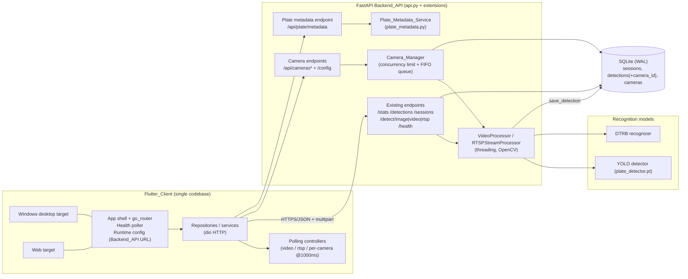
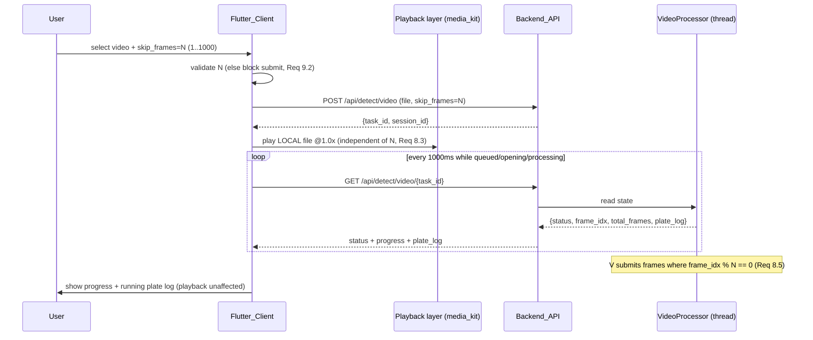
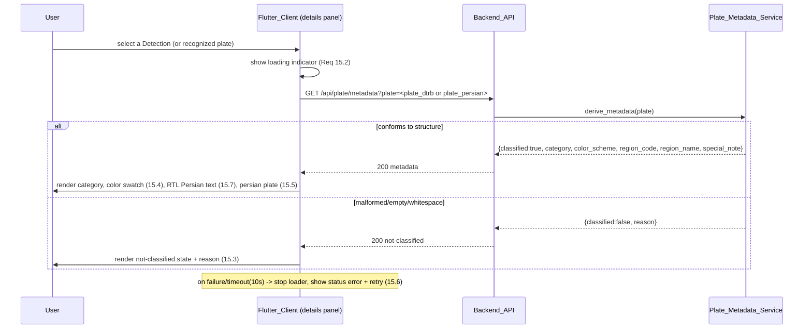
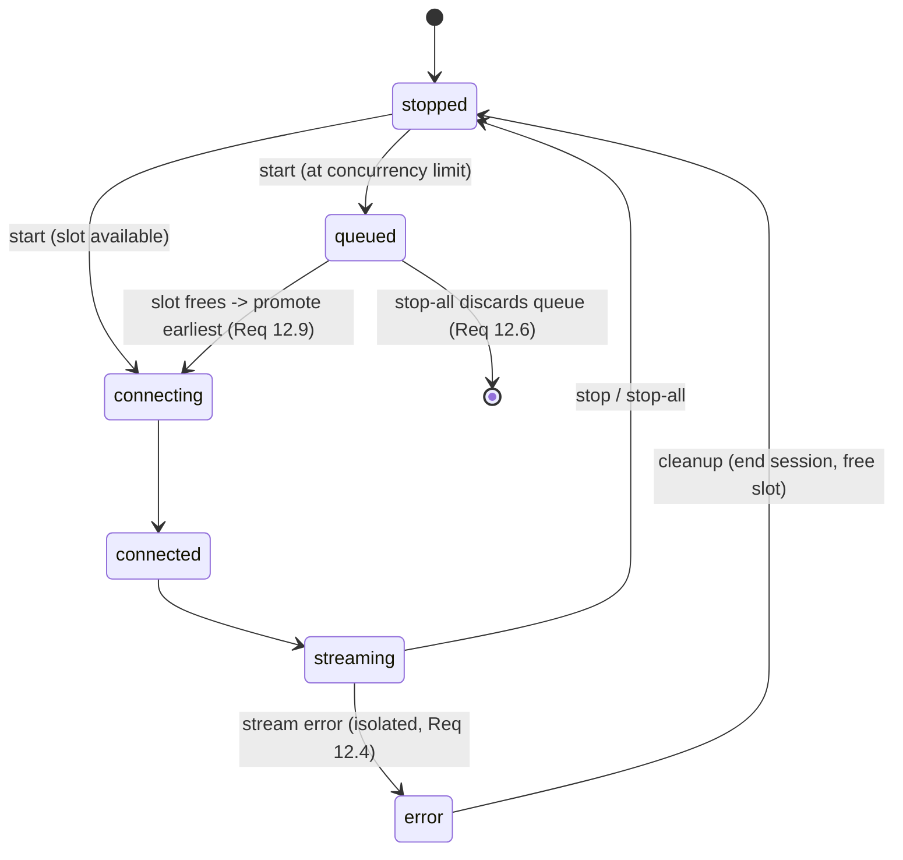

# Design Document

## Overview

This feature delivers a new Flutter client (Windows desktop + Web, single codebase) that replaces the
legacy React frontend, plus a set of additive extensions to the existing Python FastAPI backend
(`api.py`, `db.py`, `video_processor.py`). The design is deliberately **extension-first**: the existing
endpoints, threading-based processors, SQLite WAL store, base64 frame encoding, the `DTRB_TO_PERSIAN`
map, and `format_plate_persian` are reused as-is. New behavior is layered on top via new modules and
new endpoints, and the existing database is migrated additively (no destructive rewrites).

The work breaks into four buildable areas, each mapped to the requirements:

1. **Flutter client shell + existing views** (Requirements 1–10, 15) — recreate Dashboard, History,
   Analytics, Sessions, Detection (image/video/RTSP) over current endpoints, with a runtime-configured
   backend URL, health polling, plate details panel, and smooth playback decoupled from frame sampling.
2. **Multi-camera management + concurrency** (Requirements 11–13) — a backend `Camera_Manager` with a
   `cameras` table, concurrency limit with FIFO queueing, per-camera task/session, and a responsive
   multi-camera grid in the client.
3. **Per-camera attribution + sampling validation** (Requirements 8, 9, 13.9) — add `camera_id`/
   `camera_name` to detections and thread them through `save_detection`/`on_detection`; enforce
   `skip_frames` range 1–1000 at the API boundary.
4. **Plate metadata service** (Requirements 14, 15) — a new `plate_metadata.py` module + endpoint that
   parses an Iranian plate, derives category/color/region from the letter and region code, accepts both
   Persian and latin (dtrb) encodings, and returns a safe not-classified result for malformed input.

### Key constraints and platform notes

- **Single Flutter codebase, two targets.** Windows desktop and Web are built from the same source.
  Platform differences are isolated behind small abstractions (file picking, video playback, frame
  rendering).
- **RTSP cannot be decoded in a browser.** RTSP decoding stays on the backend (OpenCV in
  `RTSPStreamProcessor`). The client never opens an RTSP socket; it renders backend-produced annotated
  frames delivered as base64 JPEG via the existing status endpoints. This is true on both Web and
  Windows, keeping behavior identical across targets.
- **Local video playback differs by target.** For uploaded video, the client plays the *local* file at
  1.0× while the backend processes a *copy* and the client polls task status + plate log. On Windows the
  local file path is available; on Web the picked file is exposed as bytes/object URL. The playback layer
  abstracts this difference.
- **Playback is decoupled from sampling.** The visual `Playback_Stream` always runs at 1.0× real time.
  The `Sampling_Interval` (`skip_frames`) only controls how often the backend submits a frame for
  recognition; it never throttles or drives the on-screen video.

### Recommended Flutter libraries

| Concern | Library | Rationale |
| --- | --- | --- |
| State management | **Riverpod** (`flutter_riverpod` v2) | Compile-safe providers, no `BuildContext` coupling, excellent for many independent async controllers (one polling controller per camera). Scales cleanly to the multi-camera grid where each panel owns an autonomous async lifecycle. Bloc is a valid alternative but is heavier for the large number of small, independent polling units here. |
| Routing | **go_router** | Declarative, URL-based routing that works identically on Web (deep links, browser back/forward) and desktop. Required by Requirement 1 navigation semantics. |
| HTTP | **dio** | Interceptors, per-request timeouts (needed for the 5s health and 10s view timeouts), `FormData` multipart for image/video upload, cancellation tokens for stopping polling. |
| Charts | **fl_chart** | Mature, pure-Dart line/bar/pie charts for the Dashboard and Analytics views; works on Web + Windows with no native deps. |
| Video playback | **media_kit** (`package:media_kit` + `media_kit_video`) | Single API that supports Windows desktop and Web, libmpv-backed on desktop, hls/native on web. Chosen over `video_player` because `video_player` has weak/older desktop support. `video_player` remains a documented fallback for environments where media_kit native libs are unavailable. |
| File picking | **file_picker** | Cross-platform image/video selection returning both a path (desktop) and bytes (web), matching the playback abstraction's needs. |
| Responsive layout | **flutter_layout_grid** / `LayoutBuilder` + `GridView` | Drives the scrollable responsive multi-camera grid (Requirement 13.8). `LayoutBuilder` is sufficient; `flutter_layout_grid` is optional sugar. |
| Persian/RTL text | Flutter built-in `Directionality` + bundled Persian font (e.g. **Vazirmatn**) | Requirement 15.7 RTL rendering; bundling a font guarantees consistent shaping on both targets. |

Backend additions use only the existing stack: FastAPI, Pydantic (for request validation), the standard
`sqlite3` module, and Python `threading`. No new heavyweight dependencies are introduced server-side.

## Architecture

### High-level system diagram



### Request/processing flows

- **Static views (Dashboard, History, Analytics, Sessions):** request/response only, against existing
  endpoints. No change server-side beyond confirming `days` validation.
- **Image detection:** single multipart POST, synchronous response with annotated base64 image + plates.
- **Video detection:** multipart POST starts a background `VideoProcessor` thread; client polls
  `/api/detect/video/{task_id}` at 1000 ms while playing the local file at 1.0×.
- **Single RTSP:** form POST starts an `RTSPStreamProcessor` thread; client polls
  `/api/detect/rtsp/{task_id}` at 1000 ms and renders the backend's annotated base64 frame.
- **Multi-camera:** client manages `Camera` records via `/api/cameras*`; `Camera_Manager` owns the
  concurrency limit and FIFO queue and starts/stops `RTSPStreamProcessor` instances. Each running camera
  reuses the existing `/api/detect/rtsp/{task_id}` status contract for its per-camera live view.
- **Plate metadata:** stateless lookup against `/api/plate/metadata`, used by the plate details panel.

### Backend module layout (extensions)

```
api.py                 # existing app; new routers/endpoints registered here
db.py                  # existing; + cameras table, + detections.camera_id, + camera CRUD helpers
video_processor.py     # existing; reused unchanged except on_detection signature gains camera id
plate_metadata.py      # NEW: parsing + category/color/region derivation
camera_manager.py      # NEW: Camera_Manager (concurrency limit, FIFO queue, lifecycle, persistence)
plate_reference.py     # NEW: static reference data (letter->category->color, region code->province)
schemas.py             # NEW: Pydantic request/response models for new + validated endpoints
```

## Components and Interfaces

### Backend: Sampling interval validation (Requirement 9)

The existing `/api/detect/video` and `/api/detect/rtsp` accept `skip_frames` as a bare `Form(int)` with
no bounds. The design adds Pydantic/`Form` constraints so out-of-range values are rejected **before** a
task or session is created (Requirement 9.1).

```python
# In api.py — validation moves to the parameter declaration so FastAPI returns 422
# BEFORE the handler body runs (no start_session, no thread spawned).
from fastapi import Form

@app.post("/api/detect/video")
async def detect_video(
    file: UploadFile = File(...),
    skip_frames: int = Form(30, ge=1, le=1000),   # was Form(30)
    fast_mode: bool = Form(False),
):
    ...

@app.post("/api/detect/rtsp")
def detect_rtsp(
    url: str = Form(...),
    fast_mode: bool = Form(False),
    skip_frames: int = Form(15, ge=1, le=1000),    # was Form(15)
):
    ...
```

FastAPI returns a `422 Unprocessable Entity` whose body identifies the offending field
(`loc: ["body", "skip_frames"]`), satisfying "identifies Sampling_Interval as the invalid field"
(Requirement 9.1). Because validation occurs during request parsing, no `start_session` call or thread
spawn happens for invalid input. `days` is already constrained by `Query(14, ge=1, le=90)` on
`/api/detections/timeline`; this is confirmed and left unchanged (Requirements 5.3, 5.7).

### Backend: Camera_Manager (Requirements 11, 12)

`camera_manager.py` introduces a single process-wide `CameraManager` instance that owns camera lifecycle,
the concurrency limit, and the FIFO queue. It reuses `RTSPStreamProcessor` verbatim for actual stream
processing and `start_session`/`end_session` for session bookkeeping.

```python
class CameraManager:
    def __init__(self, ensure_models, on_detection_factory):
        self._lock = threading.RLock()
        self._cameras: dict[int, CameraRuntime] = {}   # camera_id -> runtime state
        self._queue: deque[int] = deque()              # FIFO of camera_ids waiting for a slot
        self._concurrency_limit = load_concurrency_limit_or_default(4)  # Req 12.7
        self._ensure_models = ensure_models
        self._on_detection_factory = on_detection_factory

    # CRUD (persisted to cameras table)
    def add_camera(self, name: str, url: str, skip_frames: int | None) -> CameraRecord: ...
    def list_cameras(self) -> list[CameraView]: ...
    def update_camera(self, camera_id: int, name=None, url=None, skip_frames=None) -> CameraRecord: ...
    def remove_camera(self, camera_id: int) -> None: ...        # stops processor, ends session, deletes row

    # Lifecycle
    def start_camera(self, camera_id: int) -> StartResult: ...  # runs now OR enqueues (Req 12.3)
    def stop_camera(self, camera_id: int) -> None: ...          # frees a slot -> dequeue earliest (Req 12.9)
    def start_all(self) -> list[StartResult]: ...
    def stop_all(self) -> None: ...                             # stop running, discard queue (Req 12.6)

    # Config
    def set_concurrency_limit(self, value: int) -> None: ...    # 1..64 enforced at API layer (Req 12.2/12.8)

    # Restart restoration
    def restore_on_startup(self) -> None: ...                   # load persisted cameras, status=stopped (Req 11.8)
```

Key behaviors:

- **Concurrency limit + FIFO queue (12.1, 12.3, 12.9):** `start_camera` acquires `_lock`; if
  `len(running) < limit` it starts an `RTSPStreamProcessor` immediately, otherwise it appends the
  `camera_id` to `_queue` and marks status `queued`. When any processor stops or errors and the queue is
  non-empty, `_promote_from_queue()` pops the **earliest** queued camera and starts it. Promotion is the
  single choke-point that enforces both the limit and FIFO ordering.
- **Distinct task_id + session per camera (12.5):** each started camera gets a fresh `task_id`
  (`uuid4().hex`) and a fresh `start_session("rtsp", url)`. These are stored on the `CameraRuntime` and
  also registered in the existing `_tasks` dict so the existing `/api/detect/rtsp/{task_id}` status and
  stop endpoints work unchanged for per-camera polling (Requirement 13.3).
- **Error isolation (12.4):** the per-camera `on_detection` and a status watcher observe each processor.
  If a processor's status begins with `error`, the manager marks only that camera `error`, ends its
  session, frees its slot, and triggers queue promotion. Other processors are untouched. Exceptions in
  one camera's thread cannot propagate to siblings because each `RTSPStreamProcessor` already runs in its
  own daemon thread with a try/except around frame processing.
- **Persistence + restore (11.8):** `add/update/remove` write through to the `cameras` table. On startup
  `restore_on_startup()` loads all rows into `_cameras` with status `stopped` (processing is never
  auto-resumed; the operator starts cameras explicitly).
- **Stop-all (12.6):** stops every running processor, ends each session, and clears `_queue` so queued
  cameras are discarded (not auto-started later).

`CameraRuntime` holds: `record` (persisted fields), `status` in `{stopped, queued, connecting, connected,
streaming, error}`, `task_id`, `session_id`, and a reference to the `RTSPStreamProcessor`.

### Backend: per-camera attribution in detections (Requirements 13.9, 13.2)

The `on_detection` callback signature in `video_processor.py` is extended to carry an optional camera
identifier, and `save_detection` gains `camera_id`/`camera_name` parameters. This is additive and
backward compatible (defaults `None`).

```python
# video_processor.py — RTSPStreamProcessor/VideoProcessor call:
#   self.on_detection(src, text, conf, source, frame, ftime)
# becomes (camera id passed by the closure the Camera_Manager builds):
#   self.on_detection(src, text, conf, source, frame, ftime)   # signature unchanged at call site
#
# The Camera_Manager builds a per-camera closure that already knows its camera_id/name:

def on_detection_factory(session_id, camera_id, camera_name):
    def on_det(src, text, conf, source, frame, ftime):
        save_detection(session_id, src, text, format_plate_persian(text), conf,
                        source, frame, ftime,
                        camera_id=camera_id, camera_name=camera_name)
    return on_det
```

Because the camera identity is captured in the closure built by `Camera_Manager`, the
`RTSPStreamProcessor` itself needs no change — it keeps calling `on_detection(...)` with its existing
arguments. Single (non-camera) RTSP and video paths pass `camera_id=None`, so existing rows and code
remain valid.

### Backend: Plate_Metadata_Service (Requirement 14)

`plate_metadata.py` is a pure module (no I/O, no model loading) so it is cheap to property-test. It
depends on static reference data in `plate_reference.py`.

```python
# plate_metadata.py
def normalize_plate(raw: str) -> NormalizedPlate | None:
    """
    Accept Persian OR latin (dtrb) encoding. Returns a structured plate or None if it does
    not conform to: 2 digits, 1 letter, 3 digits, 2-digit region code.
    Strategy:
      1. Reject None/empty/whitespace-only early.
      2. Normalize Persian digits -> ASCII digits; normalize Persian letters -> latin via an
         inverse of DTRB_TO_PERSIAN (PERSIAN_TO_DTRB). Latin letters pass through lowercased.
      3. Strip separators/spaces/dashes used by format_plate_persian ("12 b 345-67").
      4. Validate token shape: [0-9]{2} [letter] [0-9]{3} [0-9]{2}.
    """

def derive_metadata(raw: str) -> PlateMetadata:
    """
    Always returns a PlateMetadata; never raises (Req 14.6, 16.6).
    classified=False with a reason for malformed/empty/null/whitespace.
    """
```

Encoding normalization reuses and extends the existing `DTRB_TO_PERSIAN` map from `video_processor.py`.
Note that map is many-to-one (`o, u, v, w -> و` and `i, y -> ی`), so a naive inverse is ambiguous. The
service therefore canonicalizes on the **category letter**, not on a specific latin char: both the
Persian letter and any latin letter that maps to it resolve to the same category/color, which is exactly
what Requirement 14.8 requires (identical results across encodings). For category lookup we map each
recognized letter (Persian or latin) to a canonical category key via `LETTER_TO_CATEGORY`.

```python
@dataclass
class PlateMetadata:
    classified: bool
    category: str | None        # e.g. "Private", "Taxi/Public", "Government", ...
    color_scheme: str | None    # one of white|yellow|green|red|blue|black
    region_code: str | None     # two-digit string, e.g. "11"
    region_name: str | None     # province/region name or unknown indicator
    special_note: str | None    # e.g. Free Zone / Arvand note
    reason: str | None          # populated only when classified is False
```

### Backend: new endpoints

| Method | Path | Request | Response | Requirement |
| --- | --- | --- | --- | --- |
| POST | `/api/cameras` | `{name, url, skip_frames?}` | `CameraView` | 11.1, 11.2 |
| GET | `/api/cameras` | – | `{data: CameraView[]}` | 11.7 |
| PUT/PATCH | `/api/cameras/{id}` | `{name?, url?, skip_frames?}` | `CameraView` | 11.5 |
| DELETE | `/api/cameras/{id}` | – | `{status}` | 11.4 |
| POST | `/api/cameras/{id}/start` | – | `{task_id?, status}` (running or queued) | 12.1, 12.3 |
| POST | `/api/cameras/{id}/stop` | – | `{status}` | 11.4, 12.9 |
| POST | `/api/cameras/start-all` | – | `{data: StartResult[]}` | 12.1 |
| POST | `/api/cameras/stop-all` | – | `{status}` | 12.6 |
| GET | `/api/config/concurrency` | – | `{concurrency_limit}` | 12.7 |
| PUT | `/api/config/concurrency` | `{value: int(1..64)}` | `{concurrency_limit}` | 12.2, 12.8 |
| GET | `/api/plate/metadata` | `?plate=...` | `PlateMetadata` | 14.7 |

Per-camera live polling reuses the existing `GET /api/detect/rtsp/{task_id}` and
`POST /api/detect/rtsp/{task_id}/stop` (Requirement 13.3). Name validation (empty allowed at creation but
blocks start; case-insensitive trimmed duplicate rejection) is enforced primarily in the client
(Requirements 11.2, 11.3, 11.6) and defensively in the manager.

### Flutter client structure

```
lib/
  main.dart                       # bootstrap: load runtime config, init Riverpod, run app
  app/
    app.dart                      # MaterialApp.router + go_router config
    router.dart                   # routes: /dashboard /history /analytics /sessions /detection /cameras
    config.dart                   # RuntimeConfig: backend base URL source + validity (Req 1.5, 1.8)
    theme.dart                    # theme + bundled Persian (Vazirmatn) font
  core/
    api_client.dart               # dio instance, base URL, timeouts, error mapping
    health_controller.dart        # health poll @ startup(5s) + 30s while disconnected (Req 2)
  data/
    models/                       # typed models mirroring API contract (see Data Models)
    repositories/                 # StatsRepo, DetectionsRepo, SessionsRepo, DetectRepo, CameraRepo, PlateMetaRepo
  features/
    dashboard/  history/  analytics/  sessions/
    detection/                    # image + video + single RTSP
    cameras/                      # multi-camera grid + camera management
    plate_details/                # plate details panel
  shared/
    playback/                     # platform-abstracted video playback (media_kit)
    widgets/                      # loading/error/empty indicators, connectivity badge, color swatch
```

### Client: app shell, navigation, runtime config, health (Requirements 1, 2)

- **Navigation (1.2–1.4, 1.6):** `go_router` with a persistent shell (`NavigationRail` on wide/desktop,
  `NavigationBar`/drawer on narrow). The active view changes only on explicit selection. Default route is
  `/dashboard` (1.6). A view-render failure is caught by an error boundary widget that keeps the prior
  route visible and shows an error indicator (1.9).
- **Runtime config (1.5, 1.8):** `RuntimeConfig` reads the backend base URL from a runtime source —
  `--dart-define=BACKEND_URL=...` and, on Web, an optional `window`-injected value / `config.json` fetched
  at boot. If missing or not a valid absolute http(s) URL, the app shows a configuration-error indicator
  and does **not** attempt any backend connection (1.8).
- **Health (2.1–2.7):** `HealthController` (Riverpod `AsyncNotifier`) calls `/api/health` with a 5s dio
  timeout at startup. `status == "ok"` -> connected badge; otherwise/timeout/transport-failure ->
  disconnected badge + retry control, and a 30s periodic re-check while disconnected. Retry re-issues
  immediately and updates the badge from the response. Startup always proceeds to Dashboard regardless of
  health result (1.7, 2.4).

### Client: Dashboard, History, Analytics, Sessions (Requirements 3–6)

These views are read-only over existing endpoints. Each uses a Riverpod `FutureProvider`/`AsyncNotifier`
per data source so a single failing request shows a localized error while siblings render (3.8, 5.6).

- **Dashboard (3):** parallel requests to `/api/stats`, the four chart endpoints, and `/api/detections?
  limit=10`. `avg_confidence == null` -> non-numeric placeholder (3.5); otherwise formatted as a
  percentage with one decimal (3.6). Per-request 10s timeout with retry (3.7, 3.9).
- **History (4):** `/api/detections` with `limit=50, offset=0`; source-type filter resets offset (4.2);
  search debounced 300 ms resets offset (4.3); pagination via `limit` (clamped 1–1000) + `offset` while
  `total > limit` (4.5); empty `data` -> empty-state (4.7); failure retains previous results + error (4.6).
- **Analytics (5):** timeline default `days=7`; selectable 7/14/30/90 (5.1, 5.2); letter-frequency sorted
  by count desc, ties by letter asc (5.4); per-chart empty-state and error isolation (5.5, 5.6).
- **Sessions (6):** `/api/sessions?limit` (1–100, default 20); duration = `ended_at − started_at` as a
  non-negative integer seconds when both present (6.3), running indicator when no `ended_at` (6.4); status
  styling distinguishes running/done/error (6.5); failure -> error + retry + retain (6.6).

### Client: Detection — image, video, RTSP (Requirements 7, 8, 9, 10)

- **Image (7):** `file_picker` selects JPEG/PNG/BMP ≤10 MB (client-side validation, 7.7); multipart POST
  to `/api/detect/image`; render annotated base64 image + plate list with confidence as percentage to one
  decimal (7.2); no plates -> message (7.3); error -> message incl. status (7.4); processing indicator +
  disabled submit while in flight, prior results retained (7.5, 7.6); 60s timeout -> clear + re-enable +
  timeout message (7.9); selecting a plate opens the details panel (7.10).
- **Video (8):** the `Sampling_Interval` input is validated client-side to an integer 1–1000 (9.2),
  default 30 (9.3). On submit, multipart POST with `skip_frames` (8.1). A **`VideoTaskController`** polls
  `/api/detect/video/{task_id}` at 1000 ms while status ∈ {queued, opening, processing} (8.2), computing
  progress `round(frame_idx/total_frames*100)` when `total_frames>0`, else indeterminate (8.2, 8.11).
  Terminal handling: `done` -> expose output via `/media` (8.7); `error` -> show detail and, if partial
  output exists, expose it (8.8, 8.9), and keep the error visible until success (8.10); `cancelled` ->
  stop polling + cancelled state (8.12). Stop control calls `/stop` (8.6).
- **Smooth playback decoupling (8.3, 10.7):** the playback layer plays the media at a fixed 1.0× rate.
  For **uploaded video**, the client plays the *local* picked file (path on Windows, object URL/bytes on
  Web) entirely client-side; the backend processes its own saved copy and the client only *polls* status
  and the plate log. The poll interval (1000 ms) and the `skip_frames` value never touch the video
  controller's playback rate. For **RTSP**, there is no client-decodable stream; the "playback" is the
  sequence of backend annotated base64 frames refreshed each poll, which advances independently of
  `skip_frames` (the backend already samples internally).
- **Single RTSP (10):** validate non-empty `rtsp://` URL (10.2); POST `url` + `skip_frames` (default 15,
  9.4) to `/api/detect/rtsp`, retain `task_id` (10.1); poll `/api/detect/rtsp/{task_id}` at 1000 ms while
  status ∈ {initialized, connecting, connected, streaming} and render latest annotated frame + live lines
  + history (10.3); retain last frame or show waiting placeholder when none (10.4); stop -> `/stop` + stop
  polling (10.5); status beginning with `error` -> show + stop polling within one cycle (10.6).

#### Sampling decoupling sequence (uploaded video)



### Client: Multi-camera grid + per-camera live view (Requirements 11, 12, 13)

- **Camera management UI (11):** add camera (name 0–100 chars, URL, optional `skip_frames`) via
  `/api/cameras`; empty name allowed at creation (11.2) but start is blocked with a name-required message
  while the name has no non-whitespace char (11.3); rename via PUT and reflect everywhere (11.5);
  case-insensitive, whitespace-trimmed duplicate-name rejection client-side (11.6); remove via DELETE
  (11.4); list shows name, status ∈ {stopped, connecting, connected, error}, and `skip_frames` (11.7).
- **Concurrency config (12.2, 12.7, 12.8):** a concurrency-limit control validates integer 1–64; invalid
  values are rejected, the previously applied limit is retained, and a validation message is shown. The
  applied value is sent to `PUT /api/config/concurrency`.
- **Grid + per-camera polling (13.1, 13.3, 13.8):** each running camera renders a panel showing its name,
  latest annotated frame, and live detection lines. Each panel owns an independent Riverpod
  `CameraPollController` polling that camera's `/api/detect/rtsp/{task_id}` at exactly 1000 ms. Panels lay
  out in a scrollable responsive `GridView` (column count from `LayoutBuilder` width) that shows every
  running camera up to the concurrency limit without overlap.
- **Attribution + terminal handling (13.2, 13.4, 13.7):** detections are attributed to the camera's name
  via the per-camera panel context (and persisted `camera_id`/`camera_name` server-side). On `done`/`error`
  the controller stops polling and retains the last frame + lines (13.4). Missing/undecodable frame ->
  frame-unavailable placeholder while still showing live lines (13.7).
- **Enlarged single-camera view (13.5, 13.6):** selecting a camera shows an enlarged live view + full
  plate history; if history fails to load, show the enlarged live view + history-unavailable message and
  retain the prior live view.

#### Multi-camera start with queueing sequence

```mermaid
sequenceDiagram
  participant U as User
  participant C as Flutter_Client
  participant A as Backend_API
  participant M as Camera_Manager

  U->>C: start-all (limit=4, cameras=6)
  C->>A: POST /api/cameras/start-all
  A->>M: start each camera
  loop per camera
    alt running < limit
      M->>M: spawn RTSPStreamProcessor (new task_id + session)
      M-->>A: {camera_id, task_id, status: running}
    else limit reached
      M->>M: enqueue camera_id (FIFO)
      M-->>A: {camera_id, status: queued}
    end
  end
  A-->>C: StartResult[] (4 running, 2 queued)
  C->>C: poll each running task @1000ms; show queued badges
  Note over M: when a processor stops/errors and queue non-empty
  M->>M: promote earliest-queued camera -> start (Req 12.9)
```

## Data Models

### SQLite schema changes (additive, non-destructive)

The existing `sessions` and `detections` tables are preserved. Two changes are introduced:

1. **New `cameras` table.**
2. **New nullable columns on `detections`:** `camera_id`, `camera_name`.

```sql
-- NEW table (created in init_db via CREATE TABLE IF NOT EXISTS)
CREATE TABLE IF NOT EXISTS cameras (
    id            INTEGER PRIMARY KEY AUTOINCREMENT,
    name          TEXT NOT NULL DEFAULT '',     -- empty allowed (Req 11.2)
    url           TEXT NOT NULL,
    skip_frames   INTEGER NOT NULL DEFAULT 15,  -- RTSP default (Req 9.4)
    created_at    TEXT NOT NULL,
    updated_at    TEXT
);

-- NEW config table (single-row key/value; stores concurrency limit) — Req 12.7
CREATE TABLE IF NOT EXISTS app_config (
    key   TEXT PRIMARY KEY,
    value TEXT NOT NULL
);
```

**Migration approach for `detections` (preserves existing DB):** run additive `ALTER TABLE` guarded by a
column-existence check, executed in `init_db()` after the `CREATE TABLE IF NOT EXISTS` statements. SQLite
`ALTER TABLE ... ADD COLUMN` is non-destructive and fast (metadata-only), and adding a nullable column
does not rewrite existing rows.

```python
def _ensure_column(conn, table, column, ddl):
    cols = {r["name"] for r in conn.execute(f"PRAGMA table_info({table})")}
    if column not in cols:
        conn.execute(f"ALTER TABLE {table} ADD COLUMN {ddl}")

# inside init_db(), after executescript(...):
_ensure_column(conn, "detections", "camera_id",   "camera_id INTEGER")
_ensure_column(conn, "detections", "camera_name", "camera_name TEXT")
```

`save_detection` gains two optional trailing parameters so all existing callers keep working:

```python
def save_detection(session_id, source_type, plate_dtrb, plate_persian, confidence,
                   source_file=None, frame_number=0, frame_time=None,
                   camera_id=None, camera_name=None):
    ...
    "INSERT INTO detections (session_id, timestamp, source_type, source_file, plate_dtrb, "
    "plate_persian, confidence, frame_number, frame_time, camera_id, camera_name) "
    "VALUES (?, ?, ?, ?, ?, ?, ?, ?, ?, ?, ?)"
```

### API request/response schemas (new endpoints)

Existing schemas (`Stats`, `Detection`, `DetectionsResponse`, `Session`, `DetectImageResponse`,
`VideoTaskStatus`, `RTSPTaskStatus`, etc.) are unchanged. New Pydantic models:

```python
# schemas.py
class CameraCreate(BaseModel):
    name: str = Field("", max_length=100)         # empty allowed (Req 11.2)
    url: str
    skip_frames: int | None = Field(None, ge=1, le=1000)

class CameraUpdate(BaseModel):
    name: str | None = Field(None, max_length=100)
    url: str | None = None
    skip_frames: int | None = Field(None, ge=1, le=1000)

class CameraView(BaseModel):
    id: int
    name: str
    url: str
    skip_frames: int
    status: str            # stopped|queued|connecting|connected|streaming|error
    task_id: str | None
    session_id: int | None

class StartResult(BaseModel):
    camera_id: int
    status: str            # running|queued|error
    task_id: str | None

class ConcurrencyConfig(BaseModel):
    value: int = Field(..., ge=1, le=64)           # Req 12.2/12.8

class ConcurrencyView(BaseModel):
    concurrency_limit: int

class PlateMetadata(BaseModel):
    classified: bool
    category: str | None = None
    color_scheme: str | None = None               # white|yellow|green|red|blue|black
    region_code: str | None = None
    region_name: str | None = None
    special_note: str | None = None
    reason: str | None = None
```

### Plate reference data (`plate_reference.py`)

Grounded in the [Vehicle registration plates of Iran](https://en.wikipedia.org/wiki/Vehicle_registration_plates_of_Iran)
Wikipedia article (content rephrased for compliance with licensing restrictions). The data is a concrete
**starter dataset** intended to be refined later; structure is fixed, values are extensible.

**Letter → category → color scheme.** The recognized series letter (mapped to a canonical category key)
drives both category and color. Both Persian letters and their latin (dtrb) equivalents resolve to the
same key.

| Category | Persian letter(s) | Latin equiv. | Color_Scheme |
| --- | --- | --- | --- |
| Private | ب، ج، د، س، ص، ط، ق، ل، م، ن، و، ه، ی | b, j, d, s, …, v, h, y | white (black on white) |
| Disabled | ژ / ♿ | zh (ž) | blue (white on light blue per article shade) |
| Taxi | ت | t | yellow (black on yellow) |
| Public | ع | o | yellow |
| Agricultural | ک | k | yellow |
| Government | الف (ا) | a | red (white on red) |
| Police (FARAJA) | پ | p | green (white on dark green) |
| Military – IRGC | ث | ṯ (th) | green |
| Military – Army | ش | š (sh) | black (per article, black on light brown; mapped to nearest allowed swatch) |
| Military – Min. Defence | ز | z | blue (white on light blue) |
| Military – General Staff | ف | f | blue |
| Temporary/Transit | گ | g | (transit) |
| Diplomatic/Political | D-series / تشریفات | – | black |

> Note: Requirement 15.4 constrains the *displayed* color indicator to one of
> {white, yellow, green, red, blue, black}. Reference entries therefore store one of those six canonical
> values; where the real plate shade is non-canonical (e.g. army light-brown), the table maps to the
> nearest allowed swatch and records the descriptive shade in `special_note`.

```python
# Canonical category keys
LETTER_TO_CATEGORY = {
    # Private (latin equivalents of the 13 private letters)
    "b": "Private", "j": "Private", "d": "Private", "s": "Private",
    "sad": "Private", "ta": "Private", "q": "Private", "l": "Private",
    "m": "Private", "n": "Private", "v": "Private", "h": "Private", "y": "Private",
    # Special categories
    "t": "Taxi", "o": "Public", "k": "Agricultural",
    "a": "Government", "p": "Police",
    "z": "Military_Defence", "f": "Military_GeneralStaff",
    "g": "Temporary_Transit",
    # ... extended for IRGC/Army/disabled via Persian-letter keys
}

CATEGORY_TO_COLOR = {
    "Private": "white", "Disabled": "blue",
    "Taxi": "yellow", "Public": "yellow", "Agricultural": "yellow",
    "Government": "red", "Police": "green",
    "Military_IRGC": "green", "Military_Army": "black",
    "Military_Defence": "blue", "Military_GeneralStaff": "blue",
    "Temporary_Transit": "white", "Diplomatic": "black",
    "FreeZone_Arvand": "white",
}
```

**Region code → province (representative starter set).** Two-digit code → province name, derived from the
article's provincial-code table. This is intentionally a representative subset that is structurally
complete (every listed code maps to a province and that province lists the code back), and can be expanded.

```python
REGION_CODE_TO_PROVINCE = {
    # Tehran City
    "10": "Tehran", "11": "Tehran", "20": "Tehran", "22": "Tehran",
    "33": "Tehran", "40": "Tehran", "44": "Tehran", "55": "Tehran",
    "66": "Tehran", "77": "Tehran", "88": "Tehran", "99": "Tehran",
    # Tehran/Alborz
    "21": "Alborz", "30": "Alborz", "38": "Alborz", "68": "Alborz", "78": "Alborz",
    # Razavi Khorasan
    "12": "Razavi Khorasan", "32": "Razavi Khorasan", "36": "Razavi Khorasan",
    "42": "Razavi Khorasan", "74": "Razavi Khorasan",
    # Isfahan
    "13": "Isfahan", "23": "Isfahan", "43": "Isfahan", "53": "Isfahan", "67": "Isfahan",
    # Fars
    "63": "Fars", "73": "Fars", "83": "Fars", "93": "Fars",
    # Khuzestan
    "14": "Khuzestan", "24": "Khuzestan", "34": "Khuzestan",
    # East/West Azerbaijan
    "15": "East Azerbaijan", "25": "East Azerbaijan", "35": "East Azerbaijan",
    "17": "West Azerbaijan", "27": "West Azerbaijan", "37": "West Azerbaijan",
    # Qom, Ilam, Ardabil, etc.
    "16": "Qom", "98": "Ilam", "91": "Ardabil",
    # ... extensible; full table per the cited article
}
```

**Free Zone / Arvand.** Free-zone plates (Arvand, Anzali, Aras, Kish, Maku, Chabahar, Qeshm) use a
distinct 5-digit numeric format rather than the standard `## X ### NN` structure. The service treats a
recognized free-zone marker as category `FreeZone_Arvand` with a `special_note` naming the zone
(Requirement 14.5). Because the standard structural validator (2 digits + letter + 3 digits + region
code) will not match a pure 5-digit free-zone plate, free-zone handling is keyed off an explicit marker
rather than the standard letter slot.

The Flutter client mirrors these as Dart models (`CameraModel`, `StartResultModel`,
`PlateMetadataModel`, `ConcurrencyConfigModel`) and reuses the existing contract for `Stats`, `Detection`,
`Session`, `VideoTaskStatus`, and `RTSPTaskStatus` from `types.ts`.

## Correctness Properties

*A property is a characteristic or behavior that should hold true across all valid executions of a
system — essentially, a formal statement about what the system should do. Properties serve as the bridge
between human-readable specifications and machine-verifiable correctness guarantees.*

Property-based testing applies strongly to this feature because the plate metadata service, region-code
mapping, frame-sampling selector, and the Camera_Manager queue/concurrency logic are pure or
deterministic units with large input spaces and clear universal properties. The UI rendering, navigation,
and per-view error indicators are covered by example/widget tests instead (see Testing Strategy).

### Property 1: Plate metadata derivation is idempotent and encoding-independent

*For any* recognized plate value that conforms to the Iranian plate structure (2 digits, 1 letter, 3
digits, 2-digit region code), deriving metadata is deterministic: deriving twice from the same value, and
deriving from the Persian encoding versus the equivalent latin (dtrb) encoding of that value, all produce
identical `category`, `color_scheme`, and `region_code`.

**Validates: Requirements 14.1, 14.4, 14.8, 16.2**

### Property 2: Region-code round-trip and unknown-region handling

*For any* region code present in the reference data, the service returns a `region_name` that maps back to
that same region code in the reference data; and *for any* two-digit region code absent from the reference
data, the service returns the unknown-region indicator for `region_name` while still classifying the plate
by its letter.

**Validates: Requirements 14.2, 14.3, 16.3**

### Property 3: Metadata derivation never raises on malformed input

*For any* input string that does not conform to the known Iranian plate structure — including empty, null,
whitespace-only, wrong-length, and arbitrary garbage values — the service returns a not-classified result
(`classified == false`) with a descriptive `reason`, returns no partial metadata, and completes without
raising an unhandled error.

**Validates: Requirements 14.6, 16.6**

### Property 4: Frame-sampling submits exactly the multiples of N

*For any* sampling interval N in 1..1000 and *for any* decoded frame count T, the set of zero-based frame
indices submitted for plate recognition equals exactly `{ i | 0 <= i < T and i mod N == 0 }`.

**Validates: Requirements 8.5, 16.5**

### Property 5: Playback rate is invariant to the sampling interval

*For any* sampling interval N in 1..1000, the configured playback rate of the `Playback_Stream` remains
1.0× and does not vary with N.

**Validates: Requirements 8.3, 10.7**

### Property 6: Camera_Manager concurrency invariants hold for any operation sequence

*For any* sequence of add/start/stop/error/remove operations applied to the Camera_Manager under a
configured concurrency limit L, the following invariants hold after every operation: (a) the number of
running RTSP_Processors never exceeds L; (b) whenever a running processor stops or errors while the queue
is non-empty, the earliest-queued camera is the next started, preserving FIFO order; (c) every running
camera has a `task_id` and a `session_id` distinct from every other running camera; (d) an error on one
camera leaves all other running cameras running; and (e) every detection produced is attributed to the
`camera_id`/`camera_name` of the camera that produced it.

**Validates: Requirements 12.1, 12.3, 12.4, 12.5, 12.9, 13.2, 13.9, 16.4**

### Property 7: Sampling-interval validation rejects out-of-range values without side effects

*For any* integer value outside 1..1000 submitted as the sampling interval, the Backend_API rejects the
request with a validation error that identifies the sampling-interval field and creates no new processing
task and no new session; and the client-side validator accepts a candidate sampling interval value if and
only if it is an integer within 1..1000 inclusive.

**Validates: Requirements 9.1, 9.2**

### Property 8: RTSP URL validation

*For any* candidate URL string, the client RTSP URL validator accepts it if and only if it is non-empty and
begins with the `rtsp://` scheme.

**Validates: Requirements 10.2**

### Property 9: Duplicate camera-name detection is case-insensitive and whitespace-trimmed

*For any* pair of camera names, the duplicate-name check treats them as duplicates if and only if they are
equal after trimming surrounding whitespace and comparing case-insensitively.

**Validates: Requirements 11.6**

### Property 10: Camera persistence round-trip

*For any* camera record created with a name, URL, and optional sampling interval, persisting the record and
reloading it yields a record with equal name and URL, the same sampling interval when one was supplied, and
the documented default sampling interval when none was supplied.

**Validates: Requirements 11.1, 11.8**

### Property 11: Concurrency-limit validation

*For any* candidate concurrency-limit value, the validator accepts it if and only if it is an integer within
1..64 inclusive; rejected values leave the previously applied limit unchanged.

**Validates: Requirements 12.2, 12.8**

### Property 12: Letter-frequency ordering

*For any* letter-frequency dataset, the rendered ordering places entries in descending order of count, and
orders entries with equal counts in ascending order of their letter value.

**Validates: Requirements 5.4**

### Property 13: Session duration is a non-negative integer number of seconds

*For any* session whose start time precedes or equals its end time, the displayed duration equals the whole
number of seconds between end and start and is always non-negative.

**Validates: Requirements 6.3**

### Property 14: Percentage formatting to one decimal place

*For any* confidence/average value (a real number in 0..1, or null), the formatter renders a percentage with
exactly one decimal place when a numeric value is present, and a non-numeric placeholder when the value is
null.

**Validates: Requirements 3.5, 3.6, 7.2**

### Property 15: Video progress percentage computation

*For any* `frame_idx` and `total_frames` with `total_frames > 0`, the displayed progress equals
`round(frame_idx / total_frames * 100)`; when `total_frames == 0`, the client displays an indeterminate
indicator rather than a percentage.

**Validates: Requirements 8.2, 8.11**

## Error Handling

### Backend

- **Sampling-interval out of range (9.1):** handled by FastAPI parameter validation (`ge=1, le=1000`).
  Returns `422` with the field location before any session/task is created. No partial side effects.
- **`days` out of range (5.7):** existing `Query(..., ge=1, le=90)` returns `422`; left unchanged.
- **Malformed plate (14.6):** `derive_metadata` is total — it wraps parsing in a guard that returns
  `PlateMetadata(classified=False, reason=...)` for null/empty/whitespace/non-conforming input. The
  endpoint never returns partial metadata and never propagates an exception.
- **Camera not found:** camera endpoints return `404` with `{"error": "Camera not found"}`, mirroring the
  existing task-not-found pattern in `api.py`.
- **Start when at limit (12.3):** not an error — returns `{status: "queued"}`. The client renders a queued
  badge rather than an error.
- **Per-camera stream error (12.4):** isolated to the failing `RTSPStreamProcessor`; the manager marks that
  camera `error`, ends its session, frees its slot, and promotes the earliest-queued camera. Sibling
  cameras are unaffected. The existing processor already sets `status = "error: ..."` and stops its own
  loop, so failures cannot cross threads.
- **Duplicate/invalid camera input:** validated client-side first (11.3, 11.6) and defensively in the
  manager; the manager returns a `409`/`422`-style error payload if a duplicate or invalid value reaches it.
- **DB migration safety:** `_ensure_column` checks `PRAGMA table_info` before `ALTER TABLE`, so re-running
  `init_db()` is idempotent and never fails on an already-migrated database. SQLite WAL mode is retained.

### Client

- **Connectivity (1.7, 2.3, 2.4):** any health failure/timeout/transport error -> disconnected badge +
  retry; startup always continues to Dashboard. A 30s re-poll runs while disconnected.
- **Configuration error (1.8):** missing/invalid backend URL -> configuration-error indicator and no
  network attempts.
- **Per-view request failure (3.7–3.9, 4.6, 5.6, 6.6, 15.6):** each data source shows a localized error +
  retry and retains previously displayed data. A failing chart does not block sibling charts.
- **View render failure (1.9):** an error-boundary widget retains the previous route and shows an error
  indicator.
- **Detection flows (7.4, 7.9, 8.9, 8.10, 10.6):** surface backend status in the message; image flow has a
  60s timeout; video error detail persists until a successful completion; RTSP error prefix stops polling
  within one cycle.
- **Frame decode failure (13.7):** undecodable annotated frame -> frame-unavailable placeholder while still
  rendering live detection lines.
- **dio error mapping:** a central interceptor maps timeouts and non-2xx responses into typed
  `ApiFailure(status, message)` so views render consistent, status-bearing error messages.

## Testing Strategy

A dual approach is used: **property-based tests** for the pure/deterministic backend and client logic with
large input spaces, and **example/widget/integration tests** for UI rendering, navigation, lifecycle, and
external wiring.

### Property-based testing

- **Backend (Python):** use **Hypothesis**. Implement each correctness property as a single Hypothesis
  test, configured for a minimum of 100 iterations (`@settings(max_examples=100)` or higher). Properties
  1–4, 6, 7 (backend half), 9–11 are backend-side.
  - Plate generators produce conforming plates in both Persian and latin encodings (Properties 1, 2), and
    a separate generator produces malformed inputs incl. empty/whitespace/wrong-length/garbage (Property 3).
  - The Camera_Manager property (Property 6) is **model-based**: a stub processor (no real OpenCV/RTSP) is
    injected so 100+ randomized operation sequences run cheaply in memory while asserting the invariants
    after every step. This keeps PBT cost low and isolates the queue/concurrency logic from I/O.
  - The frame-sampling property (Property 4) tests the pure selector function `should_sample(index, N)`
    (extracted from the `frame_idx % skip_frames == 0` logic) over random N and T.
- **Client (Dart/Flutter):** use **fast_check via package** equivalents — the idiomatic choice is the
  **`glados`** package (property-based testing for Dart) or `dart_test` with a small generator harness.
  Configure ≥100 generated cases per property. Properties 5, 7 (client half), 8, 9, 11, 12, 13, 14, 15 are
  client-side pure functions (validators, comparators, formatters, the playback-rate invariant).
- **Tagging:** every property test is tagged with a comment referencing its design property, in the format
  **Feature: flutter-multicamera-plate-ui, Property {number}: {property text}**.
- **Single test per property:** each correctness property is implemented by exactly one property-based test.

### Example, widget, and integration tests

- **Widget tests (Flutter):** navigation and default view (1.2–1.6), connectivity/config indicators
  (1.7, 1.8, 2.x), loading/empty/error states across Dashboard/History/Analytics/Sessions (3, 4, 5, 6),
  detection flows incl. processing indicator/timeout/terminal states (7, 8, 10), multi-camera grid layout
  and placeholders (13), and the plate details panel states incl. RTL rendering and color swatch mapping
  (15).
- **Integration tests (backend, Requirement 16.1):** issue one valid request to each of `/api/health`,
  `/api/stats`, `/api/detections` (+ `/timeline`, `/letters`, `/sources`, `/confidence`), `/api/sessions`,
  and `/api/plate/metadata`; assert a non-error response containing the documented data fields. Use 1–3
  representative examples (not PBT) for the plate-metadata endpoint accepting both encodings (14.7) and the
  free-zone note (14.5).
- **Build smoke tests (Requirement 1.1):** `flutter build windows` and `flutter build web` succeed from the
  single codebase.
- **Defaults and boundaries (examples):** sampling-interval defaults 30/15 (9.3, 9.4), concurrency default
  4 (12.7), `days` boundary 0/1/90/91 (5.3, 5.7), file-format/size boundaries at 10 MB (7.7).

### Verification commands

- Backend: `pytest` (run once, not in watch mode) for Hypothesis + integration tests.
- Client: `flutter test` for widget + property tests; `flutter build windows` / `flutter build web` for the
  build smoke check. Long-running dev servers/watchers are not used during verification.

## Key Scenario Flows

### Plate detail lookup (Requirements 15, 14)



### Multi-camera lifecycle with queue promotion (Requirements 12, 13)



### Requirements coverage map

| Requirement | Design coverage |
| --- | --- |
| 1 App shell & navigation | Client: app shell, go_router, runtime config, error boundary |
| 2 Connectivity & health | Client: HealthController (5s startup, 30s re-poll, retry) |
| 3 Dashboard | Client: Dashboard view, Property 14 (formatting) |
| 4 History | Client: History view (filter/search/pagination/empty-state) |
| 5 Analytics | Client: Analytics view, Property 12 (letter ordering); backend `days` validation |
| 6 Sessions | Client: Sessions view, Property 13 (duration) |
| 7 Image detection | Client: Detection (image), file validation |
| 8 Video + sampling | Client: VideoTaskController + playback decoupling; Properties 4, 5, 15 |
| 9 Sampling validation | Backend `Form(ge=1,le=1000)`; Property 7 |
| 10 Single RTSP | Client: RTSP controller; Property 8 |
| 11 Multi-camera mgmt | Camera_Manager + cameras table; Properties 9, 10 |
| 12 Concurrency | Camera_Manager limit/FIFO/promotion; Properties 6, 11 |
| 13 Per-camera view | Per-camera polling + grid; detections.camera_id; Property 6 |
| 14 Plate metadata | plate_metadata.py + plate_reference.py + endpoint; Properties 1, 2, 3 |
| 15 Plate details panel | Client: plate details panel; Property 14, color swatch |
| 16 Verification | Property tests 1–6 + integration smoke (16.1) |
