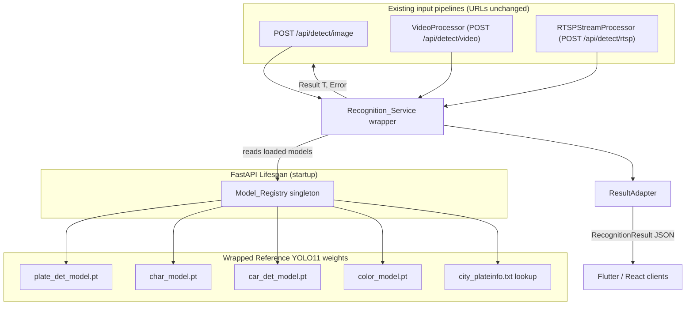
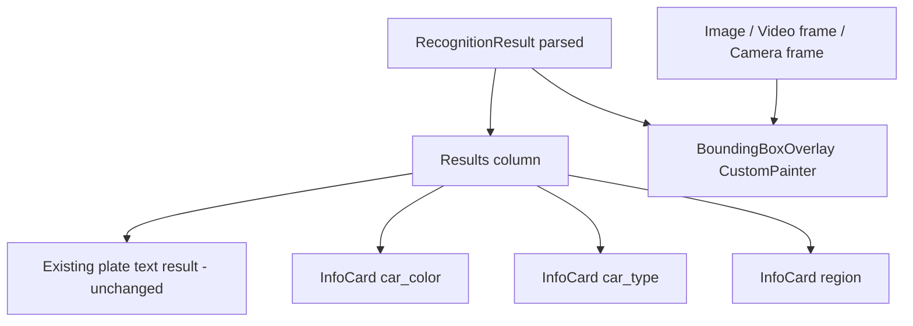

# Design Document

## Overview

This design upgrades the recognition core of the existing Persian License Plate Recognition system and adds three new vehicle-attribute capabilities (car color, car type/name, city/region lookup) without changing the existing input pipelines, endpoint URLs, or Flutter input screens.

The weak `YOLOv8 detector + DTRB recognizer` pair is replaced by the reference project's pretrained YOLO11 models. All `.pt` models and the city lookup table are loaded once at startup by a singleton `Model_Registry`. A new `Recognition_Service` wraps the reference inference logic and exposes a single, well-typed entry point that returns a `Result` value (never a raw exception). A thin adapter converts the internal detection structures into the new stable JSON contract while keeping the existing response fields additive so current consumers (the `realtime-plate-recognition` spec, React frontend) keep working.

On the Flutter side, new null-safe model fields are parsed from the response, new `Info_Card` widgets render `car_color`, `car_type`, and `region` below the existing plate text, and a `CustomPainter`-based overlay draws plate and car bounding boxes for image, video-frame, and camera-frame inputs. Existing camera/upload/video picker screens are untouched.

### Scope boundaries

- This design **composes with** the existing Iranian plate validation/metadata behavior owned by the `realtime-plate-recognition` spec. It does not redesign validation, Persian formatting, real-time display, or DB persistence.
- Accident detection (`accident_model.pt`) is out of scope.
- Reference inference logic is **wrapped**, not rewritten.

### Requirements coverage map

| Requirement | Addressed by |
|---|---|
| R1 Model Replacement | `Model_Registry`, `Recognition_Service.recognize` |
| R2 Car Color | `Recognition_Service` color stage, `Color_Model` |
| R3 Car Type | `Recognition_Service` car stage, `Car_Detector_Model` |
| R4 City/Region Lookup | `Model_Registry.city_lookup`, `ResultAdapter` |
| R5 Singleton Loading | `Model_Registry` + FastAPI lifespan |
| R6 Graceful Degradation | `Model_Registry.load_status`, nullable fields |
| R7 JSON Contract | `RecognitionResult` + `ResultAdapter` |
| R8 Preserve Pipelines | Pipeline integration (unchanged URLs) |
| R9 Frame Sampling | `should_sample`, `FrameSamplingConfig` |
| R10 Result Error Handling | `Result[T, RecognitionError]` |
| R11 Code Quality | Type hints + docstrings on public API |
| R12 Flutter Attributes UI | `InfoCard` widgets |
| R13 Preserve Flutter Inputs | No change to input screens |
| R14 Bounding Box Overlay | `BoundingBoxOverlayPainter` |
| R15 Null-safe Flutter | `RecognitionResult` Dart model |
| R16 Dependency Declaration | Dependencies section |

## Architecture



### Integration with existing `api._ensure_models()`

Today the pipelines obtain `(detector, recognizer, opt)` from `api._ensure_models()` (lazy load) and call `video_processor.process_frame(...)` / construct `VideoProcessor` / `RTSPStreamProcessor`.

The new design introduces `Model_Registry` as the single owner of all models, loaded eagerly at startup. To avoid a disruptive rewrite:

- `Model_Registry` becomes the source of truth for models. `api._ensure_models()` is retained as a thin compatibility shim that returns the legacy triple from the registry when legacy callers still need it, so nothing breaks during transition.
- The processors (`VideoProcessor`, `RTSPStreamProcessor`) and the image handler call `Recognition_Service.recognize(...)` instead of invoking the YOLOv8/DTRB code paths directly. The service internally drives the reference YOLO11 inference.
- The existing per-plate fields (normalized bbox, `metadata`, `persian_display`, `is_valid_iranian`) continue to be produced; the new fields are **added** to the same response objects (additive change).

## Components and Interfaces

### 1. Model_Registry (singleton)

Responsible for loading and holding all `.pt` weights and the city lookup once for the process lifetime, and for recording per-model load status to drive graceful degradation.

Model files live under the existing weights directory of the `alpr` project. Because the repo already contains a `weigths/` folder (note the existing spelling) and a root `plate_detector.pt`, the design standardizes on a `weights/` directory and documents both:

```
alpr/
  weights/
    plate_det_model.pt
    char_model.pt
    car_det_model.pt
    color_model.pt
  reference/                 # vendored wrapper around reference inference (no algorithm rewrite)
    city_plateinfo.txt
```

Paths are configurable via `app/config.py`-style settings (env-overridable), defaulting to the `weights/` directory.

```python
class ModelLoadStatus(Enum):
    """Load outcome for a single model weight."""
    LOADED = "loaded"
    FAILED = "failed"

@dataclass(frozen=True)
class ModelRegistryState:
    """Immutable snapshot of which capabilities are available."""
    plate_detector: ModelLoadStatus
    char_model: ModelLoadStatus
    car_detector: ModelLoadStatus
    color_model: ModelLoadStatus
    city_lookup_loaded: bool

class ModelRegistry:
    """Process-wide singleton holding all loaded models and the city lookup.

    Loads every weight once at startup; never loads per request.
    """

    @classmethod
    def instance(cls) -> "ModelRegistry":
        """Return the process-wide singleton, creating it on first call."""

    def load_all(self, config: "ModelConfig") -> ModelRegistryState:
        """Load all models and the city lookup; record per-model status.

        Required models (plate detector, char model) failing is logged.
        Optional models (car, color) failing leaves the System in
        Degraded_Operation with nullable fields. Never raises to the caller.
        """

    @property
    def plate_detector(self) -> "YOLO | None":
        """The loaded plate-detection model, or None if it failed to load."""

    @property
    def char_model(self) -> "YOLO | None":
        """The loaded character model, or None if it failed to load."""

    @property
    def car_detector(self) -> "YOLO | None":
        """The loaded car-type model, or None if unavailable (degraded)."""

    @property
    def color_model(self) -> "YOLO | None":
        """The loaded color model, or None if unavailable (degraded)."""

    def lookup_region(self, city_code: str) -> str:
        """Resolve a city code to a region name, or 'Unknown' if absent."""

    @property
    def state(self) -> ModelRegistryState:
        """Current load status of every model and the city lookup."""
```

Loaded during FastAPI startup via a `lifespan` handler:

```python
@asynccontextmanager
async def lifespan(app: FastAPI):
    ModelRegistry.instance().load_all(ModelConfig.from_env())
    yield
```

### 2. Recognition_Service (wrapper)

Single entry point used by all three pipelines. Composes plate detection → char recognition → (optional) car detection → (optional) color classification → city/region lookup, returning a `Result`.

```python
class RecognitionService:
    """Wraps the reference YOLO11 inference into one typed, Result-returning API."""

    def __init__(self, registry: ModelRegistry) -> None:
        """Bind the service to the loaded Model_Registry singleton."""

    def recognize(self, image: "np.ndarray") -> "Result[list[RecognitionResult], RecognitionError]":
        """Run the full recognition pipeline on a single image/frame.

        Returns Ok(list_of_results) on success (possibly empty), or Err(error)
        on failure. Never raises to the caller (Requirement 10).
        """

    def recognize_frame(
        self, image: "np.ndarray", frame_index: int, sampling: "FrameSamplingConfig"
    ) -> "Result[list[RecognitionResult], RecognitionError]":
        """Recognize only when frame_index is sampled; otherwise Ok([])."""
```

Internal (private) stages, each defensive and exception-safe:
- `_detect_plates(image)` → plate boxes via `plate_detector`.
- `_read_characters(image, plate_box)` → `plate_text` + per-char confidence via `char_model`.
- `_detect_car(image)` → car box + `car_type` via `car_detector` (skipped/None in degraded mode).
- `_classify_color(image, car_box)` → `car_color` via `color_model` (None on failure).
- `_resolve_region(plate_text)` → `(city_code, region)` via `registry.lookup_region`.

### 3. Result type

A minimal Either/Result used across the backend service boundary.

```python
T = TypeVar("T")
E = TypeVar("E")

@dataclass(frozen=True)
class Ok(Generic[T]):
    value: T

@dataclass(frozen=True)
class Err(Generic[E]):
    error: E

Result = Union[Ok[T], Err[E]]

@dataclass(frozen=True)
class RecognitionError:
    """Describes a recoverable recognition failure."""
    stage: str        # "plate_detect" | "char_read" | "car_detect" | "color" | "lookup"
    message: str
```

Pipelines treat `Err` as "skip this frame/image and continue" (Requirement 10.4).

### 4. RecognitionResult data model and ResultAdapter

```python
@dataclass(frozen=True)
class BoundingBoxes:
    plate: tuple[int, int, int, int]              # [x, y, w, h] pixels
    car: tuple[int, int, int, int] | None         # null when no car

@dataclass(frozen=True)
class RecognitionResult:
    plate_text: str                                # always present
    city_code: str                                 # always present
    region: str                                    # always present ("Unknown" if not found)
    car_color: str | None
    car_type: str | None
    confidence: float                              # 0..1
    timestamp: str                                 # ISO 8601
    bounding_box: BoundingBoxes
```

**Coordinate convention.** The reference detector yields pixel `[x1, y1, x2, y2]`. The adapter converts to `[x, y, w, h] = [x1, y1, x2 - x1, y2 - y1]` for the JSON contract. The existing internal normalized `0-1` bbox (used by the realtime spec/React client) is preserved separately so both consumers are satisfied.

`ResultAdapter` maps internal detection dicts (plus existing `metadata`) to `RecognitionResult` and merges into the existing per-plate response object additively:

```python
class ResultAdapter:
    """Convert internal detections into the stable JSON contract (Requirement 7)."""

    def to_result(self, detection: "InternalDetection", registry: ModelRegistry) -> RecognitionResult:
        """Build a RecognitionResult, deriving city_code/region and [x,y,w,h]."""

    def merge_into_plate_entry(self, plate_entry: dict, result: RecognitionResult) -> dict:
        """Add new contract fields to an existing plate_log entry (additive)."""
```

### 5. Frame sampling

Reuses the existing pure `should_sample(frame_index, skip_frames)` in `video_processor.py`. A small config object centralizes the default:

```python
@dataclass(frozen=True)
class FrameSamplingConfig:
    """Frame sampling parameters; default every 5th frame (Requirement 9)."""
    skip_frames: int = 5
```

`VideoProcessor` and `RTSPStreamProcessor` pass their configured interval; when unset, default 5 is used.

### 6. Pipeline integration (URLs unchanged)

- **Image** (`POST /api/detect/image`): handler calls `RecognitionService.recognize(img)`; on `Ok`, adapts each detection and adds new fields to existing `plates_out` entries; on `Err`, returns the existing validation/empty behavior.
- **Video** (`VideoProcessor`): inside the frame loop, gate with `should_sample`; for sampled frames call `recognize_frame`; merge new fields into the existing `plate_log` entries; overlay drawing and dedup/validation behavior unchanged.
- **RTSP** (`RTSPStreamProcessor`): same sampling + merge approach in the streaming loop; `history`/`live_detections` shapes unchanged with additive fields.

No route signatures or URLs change (Requirement 8.4).

## Data Models

### Flutter client models

`lib/data/models/recognition_result.dart` (new), null-safe:

```dart
class RecognitionResult {
  final String plateText;        // always present
  final String cityCode;         // always present
  final String region;           // always present
  final String? carColor;        // nullable
  final String? carType;         // nullable
  final double confidence;
  final DateTime timestamp;
  final BoundingBoxes boundingBox;

  factory RecognitionResult.fromJson(Map<String, dynamic> json);
}

class BoundingBoxes {
  final List<num> plate;         // [x, y, w, h]
  final List<num>? car;          // null when no car
}
```

Parsing treats `car_color`, `car_type`, and `bounding_box.car` as nullable (Requirement 15). New fields are read additively; existing models/screens stay intact.

## UI Design (Flutter)

- **Info cards**: new `InfoCard` widget(s) under `lib/features/detection/widgets/`, rendered below the existing plate text result. Three cards: car color, car type, region. Null fields render a placeholder dash via a shared constant. All labels come from the existing localization/constants pattern and `lib/core/persian_format.dart` — no hardcoded strings (Requirements 12, 15).
- **Bounding box overlay**: `BoundingBoxOverlayPainter extends CustomPainter` drawing the plate box (always when present) and car box (only when non-null), positioned by scaling `[x, y, w, h]` to the rendered image/frame size. A single `BoundingBoxOverlay` widget wraps image, video-frame, and camera-frame displays so the overlay works across all three input types (Requirement 14). Existing camera/upload/video picker screens are not modified (Requirement 13).



## Error Handling

- Backend service returns `Result`; callers never receive raised exceptions (Requirement 10.1-10.3). Each internal stage catches its own exceptions and degrades to `None` for optional outputs or returns `Err` for required-stage failures.
- A required-stage `Err` for one frame/image does not stop the pipeline — subsequent frames continue (Requirement 10.4), matching the existing `try/except` + logging behavior in the processors and the atomic per-image persistence contract.
- Model load failures are logged with model name + underlying error and recorded in `ModelRegistryState` (Requirement 6).
- Flutter parsing is null-safe; missing optional fields never throw (Requirement 15).

## Correctness Properties

### Property 1: Always-present fields
Every `RecognitionResult` has non-null `plate_text`, `city_code`, and `region`.

### Property 2: Region fallback
If `city_code` is not in the lookup, `region == "Unknown"`.

### Property 3: Nullable on failure
When the car/color models are unavailable or fail, `car_type`, `car_color`, and `bounding_box.car` are `null` (never fabricated).

### Property 4: Plate bbox shape
`bounding_box.plate` is always a 4-tuple of non-negative numbers in `[x, y, w, h]` form, with `w >= 0` and `h >= 0`.

### Property 5: Confidence range
`0.0 <= confidence <= 1.0`.

### Property 6: Timestamp format
`timestamp` parses as ISO 8601.

### Property 7: Frame sampling
For any `skip_frames = N >= 1`, `should_sample` is true for exactly the indices that are multiples of `N`.

### Property 8: Result never raises
`recognize`/`recognize_frame` return `Ok` or `Err` for arbitrary image arrays (including empty/garbage) and never propagate an exception.

### Property 9: bbox conversion round-trip
Converting `[x1,y1,x2,y2]` → `[x,y,w,h]` and back yields the original box for valid boxes.

### Property 10: Additive merge
Merging contract fields into an existing plate entry preserves all pre-existing keys.

## Testing Strategy

- **Unit tests** (pytest): `Model_Registry` load-status and degradation paths (simulate missing/failing weights via monkeypatch); `ResultAdapter` bbox conversion and city/region resolution; `RecognitionService` stage composition with mocked YOLO predictors.
- **Property-based tests** (hypothesis, already used in this repo per `.hypothesis/` and `conftest.py`): properties 1-10 above, especially frame sampling, bbox shape/round-trip, nullability, confidence range, and "Result never raises" with arbitrary arrays.
- **Flutter tests**: model `fromJson` null-safety (nulls for `car_color`/`car_type`/`bounding_box.car`); widget test that `InfoCard` shows a dash for null; `CustomPainter` overlay scaling logic test.
- **Regression**: confirm existing endpoint URLs and existing response fields remain unchanged; existing realtime/React consumers still parse successfully.

## Dependencies

New / pinned dependencies are listed up front. Add to `requirements.txt` (Python) and `flutter_app/pubspec.yaml` (Dart) only what is missing.

### Python (backend)
- `ultralytics>=8.0` — YOLO11 inference for the reference weights (Requirement 11.4, 16.3). Pin to a concrete `8.x` version in `requirements.txt`.
- `opencv-python`, `numpy`, `Pillow` — already used by `video_processor.py`; no new addition expected, confirm presence.
- No new Result/Either library; a tiny in-repo `Result` type is defined to avoid a dependency.

### Flutter / Dart
- No new package is strictly required: parsing uses built-in `dart:convert`, overlay uses the built-in `CustomPainter`. If the project lacks an immutable-model/codegen helper already in use, none is introduced. Any new dependency that becomes necessary during implementation will be added to `pubspec.yaml` with a pinned version and called out explicitly.

> Note: exact pinned versions are finalized during implementation against the installed toolchain; the manifests are the single source of truth (Requirement 16).
