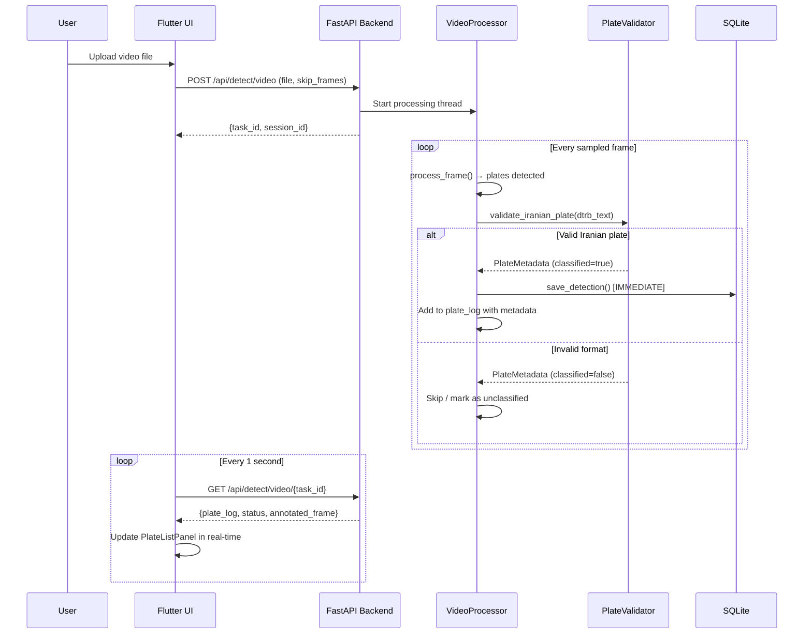
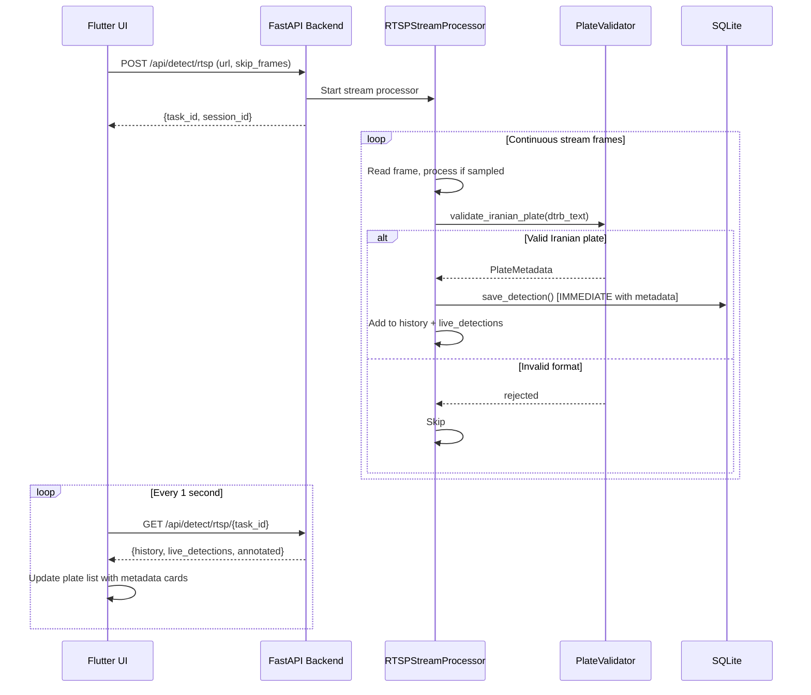

# Design Document: Real-Time Plate Recognition

## Overview

This feature enhances the Persian License Plate Recognition system with three capabilities: (1) fixing Flutter build warnings related to outdated dependencies in pubspec.yaml, (2) enabling real-time plate display and database persistence during video/RTSP processing — plates appear in the UI and are saved to SQLite as they are detected, not after the stream ends, and (3) adding Iranian plate format validation so that only plates matching valid Iranian formats (2-digit prefix + letter + 3-digit number + 2-digit region code) are accepted, with full metadata display (province, vehicle type, plate color scheme).

The system already has the building blocks: a `VideoProcessor` and `RTSPStreamProcessor` with `on_detection` callbacks, a `plate_metadata.py` module with `derive_metadata()`, and a Flutter frontend with polling controllers. This design integrates these pieces to achieve true real-time behavior and format-aware filtering.

## Architecture

```mermaid
graph TD
    subgraph Flutter Frontend
        A[VideoSubView / RtspSubView] --> B[VideoTaskController / RTSPPollController]
        B --> C[DetectRepo - Polling 1s interval]
        A --> D[PlateListPanel - Real-time]
        D --> E[PlateDetailCard - Metadata Display]
    end

    subgraph FastAPI Backend
        F[/api/detect/video/task_id] --> G[VideoProcessor]
        H[/api/detect/rtsp/task_id] --> I[RTSPStreamProcessor]
        G --> J[IranianPlateValidator]
        I --> J
        J --> K[plate_metadata.derive_metadata]
        J --> L[db.save_detection - Immediate]
    end

    C -->|HTTP Poll| F
    C -->|HTTP Poll| H
    L --> M[(SQLite DB)]
```

## Sequence Diagrams

### Real-Time Video Processing Flow



### RTSP Real-Time Streaming Flow



## Components and Interfaces

### Component 1: IranianPlateValidator (Backend - Python)

**Purpose**: Validates detected plate text against Iranian license plate formats and returns metadata. Acts as a filter gate — only plates conforming to valid Iranian formats pass through to storage and display.

**Interface**:
```python
class ValidationResult:
    is_valid: bool
    plate_text: str           # normalized plate text
    metadata: PlateMetadata | None  # from plate_metadata.derive_metadata()
    rejection_reason: str | None

def validate_iranian_plate(dtrb_text: str, confidence: float, min_confidence: float = 0.4) -> ValidationResult:
    """
    Validate a DTRB-recognized plate string against Iranian plate formats.
    
    Steps:
    1. Check minimum confidence threshold
    2. Normalize text (strip spaces, convert Persian/Arabic digits)
    3. Check length == 8 characters
    4. Validate structure: [2 digits][1 letter][3 digits][2 digits]
    5. Validate letter is a known Iranian plate series letter
    6. Validate region code exists in REGION_CODE_TO_PROVINCE
    7. Return metadata via derive_metadata() if valid
    """
    ...
```

**Responsibilities**:
- Filter out non-Iranian plate detections (random text, partial reads)
- Enforce minimum confidence threshold
- Delegate to existing `plate_metadata.derive_metadata()` for metadata extraction
- Provide rejection reasons for debugging/logging

### Component 2: Enhanced VideoProcessor.on_detection (Backend - Python)

**Purpose**: Modified callback that validates plates before saving and includes metadata in the plate_log entries sent to the frontend.

**Interface**:
```python
# Current on_detection signature (unchanged):
def on_detection(source_type: str, dtrb_text: str, confidence: float, 
                 source_file: str, frame_number: int, frame_time: str) -> None

# Enhanced internal flow within VideoProcessor._run():
# Before calling on_detection and adding to plate_log:
#   1. Call validate_iranian_plate(dtrb_text, confidence)
#   2. If valid: save to DB immediately, add to plate_log with metadata
#   3. If invalid: optionally log as unclassified, skip DB save

# Extended plate_log entry structure returned via API:
class EnhancedPlateLogEntry:
    frame: int
    time: str
    time_sec: float
    plate_text: str        # YOLO grouped text
    dtrb_text: str         # DTRB recognized text
    confidence: float
    bbox: list[float]      # normalized [x1, y1, x2, y2]
    persian_display: str   # formatted: "12 ب 345-67"
    is_valid_iranian: bool
    metadata: dict | None  # {category, category_display, color_scheme, region_code, region_name}
```

**Responsibilities**:
- Validate each detection before persisting
- Include metadata in API response for frontend display
- Maintain backward compatibility with existing `on_detection` callback signature

### Component 3: Real-Time Plate Display Widget (Flutter - Dart)

**Purpose**: Enhanced `_PlateLogPanel` that shows plate details including Iranian metadata (province, type, color) as plates arrive in real-time during video/RTSP processing.

**Interface**:
```dart
class EnhancedPlateLogEntry {
  final int frame;
  final String time;
  final double timeSec;
  final String plateText;
  final String dtrbText;
  final double confidence;
  final List<double> bbox;
  final String persianDisplay;
  final bool isValidIranian;
  final PlateMetadataModel? metadata;

  factory EnhancedPlateLogEntry.fromJson(Map<String, dynamic> json);
}

class PlateDetailCard extends StatelessWidget {
  final EnhancedPlateLogEntry entry;
  
  /// Displays:
  /// - Persian formatted plate text (e.g., "۱۲ ب ۳۴۵-۶۷")
  /// - Color swatch matching plate color scheme
  /// - Category badge (شخصی, تاکسی, دولتی, etc.)
  /// - Province/region name
  /// - Confidence percentage
  /// - Frame number / timestamp
  Widget build(BuildContext context);
}
```

**Responsibilities**:
- Render plates as they arrive (real-time via polling updates)
- Show rich Iranian plate metadata (color, type, province)
- Auto-scroll to newest detection
- Differentiate valid Iranian plates from unclassified detections

### Component 4: Dependency Fix (Flutter - pubspec.yaml)

**Purpose**: Fix build warnings by removing unused `cupertino_icons` reference and updating outdated packages.

**Responsibilities**:
- Remove `cupertino_icons` from pubspec.yaml if not used (the project uses Material Design)
- Update packages with known compatibility issues
- Ensure clean build with no font warnings

## Data Models

### Model 1: Enhanced Detection (Backend → Frontend API Response)

```python
# Backend: Extended plate_log entry in video status response
enhanced_plate_entry = {
    "frame": 150,
    "time": "5.00s",
    "time_sec": 5.0,
    "plate_text": "12b34567",           # raw YOLO grouped
    "dtrb_text": "12b34567",            # DTRB recognized
    "confidence": 0.92,
    "bbox": [0.1, 0.3, 0.4, 0.5],      # normalized
    "persian_display": "۱۲ ب ۳۴۵-۶۷",   # formatted for display
    "is_valid_iranian": True,
    "metadata": {
        "classified": True,
        "category": "Private",
        "category_display": "شخصی (Private)",
        "color_scheme": "white",
        "region_code": "11",
        "region_name": "تهران (Tehran)",
        "special_note": None
    }
}
```

**Validation Rules**:
- `dtrb_text` must be exactly 8 characters when valid
- `confidence` must be >= 0.4 for a plate to be considered valid
- `metadata` is null when `is_valid_iranian` is false
- `persian_display` always populated (even for invalid plates, shows raw text)

### Model 2: Enhanced RTSP History Entry

```python
# Backend: Extended history entry in RTSP status response
enhanced_rtsp_history_entry = {
    "dtrb_text": "12b34567",
    "yolo_text": "12b34567",
    "confidence": 0.92,
    "first_seen": "14:30:05",
    "last_seen": "14:30:12",
    "count": 3,
    "persian_display": "۱۲ ب ۳۴۵-۶۷",
    "is_valid_iranian": True,
    "metadata": {
        "classified": True,
        "category": "Private",
        "category_display": "شخصی (Private)",
        "color_scheme": "white",
        "region_code": "11",
        "region_name": "تهران (Tehran)",
        "special_note": None
    }
}
```

**Validation Rules**:
- Only entries with `is_valid_iranian == True` are saved to database
- `count` tracks how many times the same plate was seen in the stream
- Deduplication by `dtrb_text` (existing behavior preserved)

### Model 3: Flutter Enhanced Models

```dart
class EnhancedPlateLogEntry {
  final int frame;
  final String time;
  final double timeSec;
  final String plateText;
  final String dtrbText;
  final double confidence;
  final List<double> bbox;
  final String persianDisplay;
  final bool isValidIranian;
  final PlateMetadataModel? metadata;

  const EnhancedPlateLogEntry({
    required this.frame,
    required this.time,
    required this.timeSec,
    required this.plateText,
    required this.dtrbText,
    required this.confidence,
    required this.bbox,
    required this.persianDisplay,
    required this.isValidIranian,
    this.metadata,
  });

  factory EnhancedPlateLogEntry.fromJson(Map<String, dynamic> json) =>
      EnhancedPlateLogEntry(
        frame: json['frame'] as int? ?? 0,
        time: json['time'] as String? ?? '',
        timeSec: (json['time_sec'] as num?)?.toDouble() ?? 0.0,
        plateText: json['plate_text'] as String? ?? '',
        dtrbText: json['dtrb_text'] as String? ?? '',
        confidence: (json['confidence'] as num?)?.toDouble() ?? 0.0,
        bbox: (json['bbox'] as List?)
                ?.map((e) => (e as num).toDouble())
                .toList() ??
            const [0, 0, 0, 0],
        persianDisplay: json['persian_display'] as String? ?? '',
        isValidIranian: json['is_valid_iranian'] as bool? ?? false,
        metadata: json['metadata'] != null
            ? PlateMetadataModel.fromJson(json['metadata'] as Map<String, dynamic>)
            : null,
      );
}
```

## Algorithmic Pseudocode

### Algorithm 1: Iranian Plate Validation Pipeline

```pascal
ALGORITHM validate_iranian_plate(dtrb_text, confidence, min_confidence)
INPUT: dtrb_text: String (raw DTRB output), confidence: Float, min_confidence: Float
OUTPUT: ValidationResult

BEGIN
  // Step 1: Confidence gate
  IF confidence < min_confidence THEN
    RETURN ValidationResult(is_valid=false, reason="Below confidence threshold")
  END IF

  // Step 2: Normalize text
  normalized ← normalize_digits(dtrb_text)  // Persian/Arabic → ASCII digits
  normalized ← strip_separators(normalized)  // Remove spaces, dashes

  // Step 3: Length check
  IF length(normalized) ≠ 8 THEN
    RETURN ValidationResult(is_valid=false, reason="Invalid length")
  END IF

  // Step 4: Structure validation
  prefix ← normalized[0:2]   // 2 digits
  letter ← normalized[2]     // 1 letter
  number ← normalized[3:6]   // 3 digits
  region ← normalized[6:8]   // 2 digits

  IF NOT all_digits(prefix) OR NOT all_digits(number) OR NOT all_digits(region) THEN
    RETURN ValidationResult(is_valid=false, reason="Invalid digit positions")
  END IF

  IF NOT is_valid_plate_letter(letter) THEN
    RETURN ValidationResult(is_valid=false, reason="Unknown series letter")
  END IF

  // Step 5: Region code validation
  IF region NOT IN REGION_CODE_TO_PROVINCE THEN
    RETURN ValidationResult(is_valid=false, reason="Unknown region code")
  END IF

  // Step 6: Derive full metadata
  metadata ← derive_metadata(dtrb_text)
  
  RETURN ValidationResult(
    is_valid=true,
    plate_text=normalized,
    metadata=metadata,
    rejection_reason=null
  )
END
```

**Preconditions:**
- `dtrb_text` is a non-null string (may be empty)
- `confidence` is in range [0.0, 1.0]
- `min_confidence` is in range [0.0, 1.0], default 0.4

**Postconditions:**
- Returns `is_valid=true` only if ALL structural checks pass
- When `is_valid=true`, `metadata` is non-null and `metadata.classified=true`
- When `is_valid=false`, `rejection_reason` explains why

**Loop Invariants:** N/A (no loops in this algorithm)

### Algorithm 2: Real-Time Detection Processing (Video)

```pascal
ALGORITHM process_frame_with_validation(frame, frame_idx, fps, skip_frames, detector, recognizer, opt, session_id)
INPUT: frame: Image, frame_idx: Int, fps: Float, skip_frames: Int
OUTPUT: (annotated_frame, valid_plates_log)

BEGIN
  // Only process sampled frames
  IF frame_idx MOD skip_frames ≠ 0 THEN
    RETURN (frame_with_cached_overlay, [])
  END IF

  // Run detection pipeline
  annotated, plates, dtrb_results ← process_frame(frame, detector, recognizer, opt)
  
  valid_entries ← []
  
  FOR idx FROM 0 TO length(plates) - 1 DO
    // INVARIANT: all entries in valid_entries have is_valid_iranian=true
    plate ← plates[idx]
    dtrb_text ← dtrb_results[idx]
    
    // Validate against Iranian format
    validation ← validate_iranian_plate(dtrb_text, plate.confidence)
    
    persian_display ← format_plate_persian(dtrb_text)
    
    entry ← {
      frame: frame_idx,
      time: format_time(frame_idx / fps),
      dtrb_text: dtrb_text,
      confidence: plate.confidence,
      bbox: normalize_bbox(plate.bbox, frame.width, frame.height),
      persian_display: persian_display,
      is_valid_iranian: validation.is_valid,
      metadata: validation.metadata
    }
    
    IF validation.is_valid THEN
      // IMMEDIATE database save — not deferred to end
      save_detection(session_id, "video", dtrb_text, persian_display,
                     plate.confidence, source_file, frame_idx, time_str)
      valid_entries.append(entry)
    END IF
  END FOR
  
  RETURN (annotated, valid_entries)
END
```

**Preconditions:**
- `frame` is a valid BGR image (non-empty)
- `detector`, `recognizer`, `opt` are loaded and ready
- `session_id` is a valid open session in the database

**Postconditions:**
- All entries in returned `valid_plates_log` satisfy `is_valid_iranian=true`
- Every valid plate is already persisted in the database upon return
- `annotated_frame` includes visual overlays for ALL detected plates (valid or not)

**Loop Invariants:**
- All previously processed plates in `valid_entries` have `is_valid_iranian=true`
- Database state is consistent: every entry in `valid_entries` has a corresponding row in `detections`

### Algorithm 3: Real-Time Frontend Update Cycle

```pascal
ALGORITHM poll_and_update_ui(task_id, poll_interval_ms)
INPUT: task_id: String, poll_interval_ms: Int (default 1000)
OUTPUT: Continuous UI state updates

BEGIN
  previous_plate_count ← 0
  
  LOOP every poll_interval_ms
    response ← HTTP_GET("/api/detect/video/{task_id}")
    
    IF response.status = "error" THEN
      stop_polling()
      show_error(response.error)
      BREAK
    END IF
    
    IF response.status = "done" THEN
      stop_polling()
      show_complete(response)
      BREAK
    END IF
    
    // Update progress bar
    update_progress(response.frame_idx, response.total_frames)
    
    // Real-time plate list update
    current_plates ← response.plate_log
    
    IF length(current_plates) > previous_plate_count THEN
      // New plates detected since last poll
      new_plates ← current_plates[previous_plate_count:]
      
      FOR EACH plate IN new_plates DO
        // INVARIANT: plate.is_valid_iranian = true (backend filtered)
        add_to_plate_list(plate)
        animate_new_plate_card(plate)
      END FOR
      
      previous_plate_count ← length(current_plates)
      scroll_to_newest()
    END IF
    
    // Update annotated frame preview
    IF response.annotated ≠ null THEN
      update_frame_preview(response.annotated)
    END IF
  END LOOP
END
```

**Preconditions:**
- `task_id` is a valid, active task on the backend
- Network connectivity to backend API

**Postconditions:**
- UI reflects all plates detected up to the latest poll
- Plate list grows monotonically (new plates appended, never removed during processing)
- Terminal states (done/error) stop the polling loop

**Loop Invariants:**
- `previous_plate_count` ≤ `length(current_plates)` at each iteration
- All displayed plates have valid metadata (filtered by backend)

## Key Functions with Formal Specifications

### Function 1: validate_iranian_plate()

```python
def validate_iranian_plate(dtrb_text: str, confidence: float, min_confidence: float = 0.4) -> ValidationResult:
    ...
```

**Preconditions:**
- `dtrb_text` is a string (not None)
- `0.0 <= confidence <= 1.0`
- `0.0 <= min_confidence <= 1.0`

**Postconditions:**
- Returns `ValidationResult` with `is_valid=True` iff:
  - `confidence >= min_confidence`
  - normalized text length == 8
  - positions [0:2] are digits (prefix)
  - position [2] is a valid series letter (in LETTER_TO_CATEGORY or PERSIAN_LETTER_TO_CATEGORY)
  - positions [3:6] are digits (number)
  - positions [6:8] are digits AND exist in REGION_CODE_TO_PROVINCE
- When `is_valid=True`: `metadata` is non-null and `metadata.classified=True`
- When `is_valid=False`: `rejection_reason` is a non-empty string

### Function 2: Enhanced on_detection callback

```python
def on_detection_with_validation(source_type: str, dtrb_text: str, confidence: float,
                                  source_file: str, frame_number: int, frame_time: str,
                                  session_id: int) -> bool:
    ...
```

**Preconditions:**
- `session_id` references an open session (status='running')
- `dtrb_text` is the raw output from DTRB recognizer
- All parameters are non-None

**Postconditions:**
- Returns `True` if plate was valid and saved to database
- Returns `False` if plate was rejected (invalid format or low confidence)
- When returns `True`: a new row exists in `detections` table with matching `session_id`
- Database `save_detection()` is called synchronously (immediate persistence)
- No exception is raised regardless of input

### Function 3: Flutter EnhancedPlateLogEntry.fromJson()

```dart
factory EnhancedPlateLogEntry.fromJson(Map<String, dynamic> json)
```

**Preconditions:**
- `json` is a non-null Map
- Expected fields may be absent (handled with defaults)

**Postconditions:**
- Returns a valid `EnhancedPlateLogEntry` instance
- `metadata` is non-null only when `json['metadata']` is a non-null Map
- `isValidIranian` defaults to `false` when absent
- `bbox` defaults to `[0, 0, 0, 0]` when absent or malformed

## Example Usage

### Backend: Validation in VideoProcessor

```python
from plate_metadata import derive_metadata
from plate_validator import validate_iranian_plate

# Inside VideoProcessor._run() loop, after process_frame():
for idx, plate in enumerate(plates):
    dtrb_text = dtrb_results[idx] if idx < len(dtrb_results) else "-"
    
    # Validate against Iranian format
    validation = validate_iranian_plate(dtrb_text, plate["confidence"])
    
    persian_display = format_plate_persian(dtrb_text)
    
    entry = {
        "frame": frame_idx,
        "time": f"{frame_idx / fps:.2f}s",
        "time_sec": round(frame_idx / fps, 3),
        "plate_text": plate["plate_text"],
        "dtrb_text": dtrb_text,
        "confidence": plate["confidence"],
        "bbox": [round(float(x) / dim, 4) for x, dim in ...],
        "persian_display": persian_display,
        "is_valid_iranian": validation.is_valid,
        "metadata": validation.metadata_dict() if validation.is_valid else None,
    }
    
    plate_log.append(entry)
    
    # IMMEDIATE save for valid plates
    if validation.is_valid and self.on_detection:
        self.on_detection("video", dtrb_text, plate["confidence"],
                         input_path, frame_idx, f"{frame_idx / fps:.2f}s")
```

### Frontend: Real-Time Plate Card Display

```dart
// In _PlateLogPanel, rendering an enhanced entry:
Widget _buildPlateCard(EnhancedPlateLogEntry entry) {
  return Card(
    margin: const EdgeInsets.symmetric(vertical: 4),
    child: ListTile(
      leading: _buildColorSwatch(entry.metadata?.colorScheme),
      title: Text(
        entry.persianDisplay,
        style: const TextStyle(
          fontSize: 16,
          fontWeight: FontWeight.bold,
          fontFamily: 'Vazirmatn',
        ),
      ),
      subtitle: Column(
        crossAxisAlignment: CrossAxisAlignment.start,
        children: [
          if (entry.metadata != null) ...[
            Text(entry.metadata!.categoryDisplay ?? ''),
            Text(entry.metadata!.regionName ?? ''),
          ],
          Text('Frame ${entry.frame} @ ${entry.time} | '
               'Conf: ${(entry.confidence * 100).toStringAsFixed(0)}%'),
        ],
      ),
      trailing: _buildConfidenceBadge(entry.confidence),
    ),
  );
}
```

### pubspec.yaml Fix

```yaml
# Before (causes warning):
dependencies:
  cupertino_icons: ^1.0.6  # REMOVE - not used, font not bundled

# After (clean build):
dependencies:
  flutter:
    sdk: flutter
  # ... existing deps without cupertino_icons
```

## Correctness Properties

*A property is a characteristic or behavior that should hold true across all valid executions of a system — essentially, a formal statement about what the system should do. Properties serve as the bridge between human-readable specifications and machine-verifiable correctness guarantees.*

### Property 1: Valid Iranian plate acceptance with complete metadata

*For any* randomly generated valid Iranian plate string (2 digits + valid series letter + 3 digits + valid region code) with confidence >= 0.4, `validate_iranian_plate()` SHALL return `is_valid=true` with non-null metadata where `classified=true`, `category_display` is non-empty, `region_name` is non-empty, and `color_scheme` is one of {white, yellow, green, red, blue, black}. This holds regardless of whether the input uses Persian/Arabic digits or contains separator characters.

**Validates: Requirements 5.1, 5.2, 5.11, 6.2, 6.3, 6.4, 7.3**

### Property 2: Invalid length rejection

*For any* string whose normalized length (after digit conversion and separator stripping) is not exactly 8 characters, `validate_iranian_plate()` SHALL return `is_valid=false`.

**Validates: Requirements 5.3**

### Property 3: Invalid structure rejection

*For any* 8-character string where position 2 is not a recognized Iranian plate series letter, OR where positions 6-7 do not correspond to a known region code, `validate_iranian_plate()` SHALL return `is_valid=false`.

**Validates: Requirements 5.5, 5.8**

### Property 4: Low confidence rejection

*For any* string input and any confidence value below the minimum threshold (0.4), `validate_iranian_plate()` SHALL return `is_valid=false` regardless of whether the text conforms to a valid plate format.

**Validates: Requirements 5.9**

### Property 5: Rejection reason completeness

*For any* input that causes `validate_iranian_plate()` to return `is_valid=false`, the `rejection_reason` field SHALL be a non-empty string, and the metadata SHALL be null.

**Validates: Requirements 5.10, 6.6**

### Property 6: Monotonic plate log growth

*For any* sequence of poll responses during active video processing, the length of `plate_log` in each response SHALL be greater than or equal to the length in the previous response.

**Validates: Requirements 2.4**

### Property 7: RTSP deduplication by plate text

*For any* plate text detected N times (N > 1) during a single RTSP session, the history SHALL contain exactly one entry for that plate text with `count >= N`.

**Validates: Requirements 3.3**

### Property 8: Invalid plates excluded from database

*For any* plate that `validate_iranian_plate()` rejects (returns `is_valid=false`), no corresponding row SHALL exist in the `detections` table for that plate text within the current session.

**Validates: Requirements 7.4, 4.1, 4.2**

## Error Handling

### Error Scenario 1: Invalid Plate Format During Processing

**Condition**: DTRB outputs text that doesn't match Iranian plate format (e.g., partial read, non-plate text)
**Response**: `validate_iranian_plate()` returns `is_valid=false` with a reason. The plate is NOT saved to the database. It may optionally appear in the UI marked as "unclassified" (greyed out).
**Recovery**: No recovery needed. Processing continues with the next frame. This is expected behavior — not all YOLO detections will be valid plates.

### Error Scenario 2: Database Write Failure During Real-Time Save

**Condition**: SQLite write fails (disk full, locked, etc.) during immediate `save_detection()` call
**Response**: The detection is still added to the in-memory `plate_log` and displayed in the UI. An error is logged but does not stop video processing.
**Recovery**: On next successful write, subsequent detections are persisted. A retry mechanism could be added for failed writes, but the current design prioritizes processing continuity over guaranteed persistence.

### Error Scenario 3: Network Timeout During Frontend Polling

**Condition**: HTTP poll to `/api/detect/video/{task_id}` times out or returns 5xx
**Response**: The Flutter polling controller silently retries on the next interval (existing behavior). The UI shows the last known state.
**Recovery**: Automatic — next successful poll brings the UI up to date. The backend continues processing regardless of frontend connectivity.

### Error Scenario 4: RTSP Stream Disconnection

**Condition**: RTSP stream drops (network issue, camera offline)
**Response**: `RTSPStreamProcessor` sets status to `"error: stream ended"`. All plates detected up to that point are already saved in the database (real-time save). The frontend shows an error state.
**Recovery**: User can restart the stream. Previously saved plates remain in the database and are queryable.

## Testing Strategy

### Unit Testing Approach

- **plate_validator.py**: Test `validate_iranian_plate()` with valid plates, invalid lengths, bad letters, unknown regions, low confidence, Persian/Arabic digit input, edge cases (empty string, None-like)
- **Enhanced plate_log entries**: Verify metadata is correctly attached to valid entries and null for invalid ones
- **Flutter model parsing**: Test `EnhancedPlateLogEntry.fromJson()` with complete data, missing fields, null metadata

### Property-Based Testing Approach

**Property Test Library**: Hypothesis (Python), fast-check (Dart)

- See Correctness Properties section (Properties 1-8) for formal property specifications with requirement traceability
- Key properties to implement: valid plate acceptance (Property 1), invalid length rejection (Property 2), invalid structure rejection (Property 3), low confidence rejection (Property 4), rejection reason completeness (Property 5)

### Integration Testing Approach

- **End-to-end video flow**: Upload a test video, verify plates appear in poll responses during processing (not only after completion)
- **Database timing**: Verify detection rows are inserted with timestamps during processing, not batched at session end
- **RTSP simulation**: Connect to a test RTSP stream, verify real-time plate accumulation in history

## Performance Considerations

- **Validation overhead**: `validate_iranian_plate()` is O(1) per plate (string operations + dict lookups). Adds negligible overhead to the per-frame processing pipeline.
- **Database writes**: SQLite in WAL mode handles concurrent reads during writes well. Each `save_detection()` is a single INSERT — no batch buffering needed for the expected throughput (1-10 plates per second max).
- **Polling frequency**: 1-second poll interval is sufficient for real-time feel without overloading the API. The backend accumulates detections between polls.
- **Memory**: Including metadata in plate_log entries adds ~200 bytes per entry. With a cap of 500 live_detections, this is ~100KB overhead — negligible.

## Security Considerations

- **Input validation**: `validate_iranian_plate()` sanitizes all input — no SQL injection risk via plate text (parameterized queries already used in `db.py`)
- **API rate limiting**: Polling at 1s intervals from a single client is safe. No additional rate limiting needed for this feature.
- **Data integrity**: Real-time DB writes use the existing `save_detection()` which properly parameterizes all values.

## Dependencies

### Backend (Python)
- Existing: `plate_metadata.py`, `plate_reference.py`, `video_processor.py`, `db.py`
- New file: `plate_validator.py` (wraps validation logic, ~50 lines)
- No new pip packages required

### Frontend (Flutter/Dart)
- Existing: `plate_metadata_model.dart`, `video_task_model.dart`, `rtsp_task_model.dart`
- Updated: `pubspec.yaml` (remove `cupertino_icons` if unused)
- No new pub packages required

### Infrastructure
- SQLite (existing, WAL mode already configured)
- No new services or infrastructure needed
